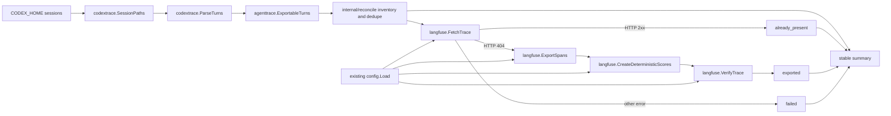

# Codex Trace Reconciliation Implementation Plan

## 1. Title and metadata

- Project name: `codex-langfuse-tracer`
- Version: 1.0
- Owners: repository maintainers
- Date: 2026-08-15
- Document ID: CLT-RECONCILE-PLAN-001

> **Design refresh required (2026-09-22):** reconciliation remains unimplemented. This plan's `FetchTrace`/HTTP-404 assumptions predate the current v2 observation reader and must be refreshed before its write path is implemented. Specify complete reads, visibility delay, error handling, and partial-trace behavior in that separate design; an empty observation response must not automatically authorize a resend. Retain the documented at-least-once policy. Reconciliation, including read-only inventory design, does not depend on completing the [delivery diagnostics follow-up](export-delivery-reliability-plan.md). The incident-specific stale-lock defect is already fixed; see the [RCA](duplicate-observations-rca-20260922.md).

This plan defines the repository-local implementation, verification, deployment, and handoff work for one `codex-langfuse-exporter --reconcile` mode. The mode inventories completed local Codex rollout turns, compares their deterministic trace IDs with the one Langfuse backend already selected by repository configuration, exports and verifies missing traces through existing owners, and reports deterministic counts. Gateway promotion belongs to external infrastructure; machine failover orchestration, Claude automation, credential rotation, and trace-retention incident work do not block this repository deliverable.

## 2. Design consensus and trade-offs

- Topic: Repository boundary
  - Verdict: DECISION
  - Rationale: This repository owns Codex source discovery, parsing, deterministic trace identity, Langfuse export, scoring, and verification. It does not own Cloudflare connector promotion or the adjacent `CLIProxyAPI-setup` repository.
- Topic: Public command surface
  - Verdict: FOR
  - Rationale: Add one exclusive `--reconcile` mode to `cmd/codex-langfuse-exporter/main.go`; do not create a shell replay tool, a second binary, or a second exporter path.
- Topic: Destination selection
  - Verdict: AGAINST
  - Rationale: Reconciliation reads the existing Langfuse configuration and has no local/shaman/target selector. A target selector would restore the client-side switching model that `README.md` rejects for production.
- Topic: Database or volume synchronization
  - Verdict: AGAINST
  - Rationale: PostgreSQL, ClickHouse, object-store, Docker volume, and watcher-state copying can overwrite divergent data or copy inconsistent live state. Deterministic trace-level recovery is the supported mechanism.
- Topic: Watcher state mutation
  - Verdict: AGAINST
  - Rationale: `~/.codex/langfuse-export-state.json` describes one workstation watcher. Reconciliation derives truth from local completed source turns and remote trace existence and must not change watcher checkpoints.
- Topic: Remote existence classification
  - Verdict: DECISION
  - Rationale: `internal/langfuse.FetchTrace` remains the one trace-fetch owner. HTTP 404 becomes a typed not-found condition; authentication, throttling, server, transport, decode, and cancellation errors remain failures.
- Topic: Export implementation ownership
  - Verdict: DECISION
  - Rationale: `internal/reconcile` composes `codextrace.SessionPaths`, `codextrace.ParseTurns`, `agenttrace.ExportableTurns`, `langfuse.ExportSpans`, `langfuse.CreateDeterministicScores`, and `langfuse.VerifyTrace`. It does not reproduce parsing, redaction, IDs, OTLP payloads, scores, or verification logic.
- Topic: Ordering and load
  - Verdict: DECISION
  - Rationale: Process sorted deterministic trace IDs sequentially. The command is an operator-triggered recovery path; concurrency flags and adaptive schedulers add surface area without demonstrated need.
- Topic: Delivery semantics
  - Verdict: DECISION
  - Rationale: Preserve documented at-least-once behavior. An active watcher can win the lookup/export race and both paths may submit the same observations. Deterministic IDs identify repeated submissions but do not guarantee receiver deduplication. Document this limitation in the refreshed design; strict duplicate prevention would require a separate delivery contract.
- Topic: Existing but incomplete remote traces
  - Verdict: AGAINST
  - Rationale: This release fills absent traces. Repair of a trace that already returns HTTP 2xx but has incomplete observations or scores is separate work requiring a real observed case and an ADR.
- Topic: Claude Code automation
  - Verdict: AGAINST
  - Rationale: Claude polling, hook installation, and historical Claude discovery are outside this deliverable. Existing Claude tests remain regression gates.
- Topic: Gateway promotion and failover orchestration
  - Verdict: AGAINST
  - Rationale: The tracer can validate reconciliation against whichever backend is configured, but it does not move `codex-langfuse-tracer.prls.co` between machines.
- Topic: Credential and trace-retention incident actions
  - Verdict: AGAINST
  - Rationale: Those actions are private operational work and are not acceptance dependencies for this repository feature. Normal secret-free output rules still apply.
- Topic: Fixture ownership
  - Verdict: DECISION
  - Rationale: `testdata/manifest.json` remains the only fixture registry; reconciliation tests reuse its Codex sources and temporary directories.

## 3. PRD / stakeholder and system needs

### Problem

A workstation can mark a deterministic trace ID processed after exporting it to one Langfuse backend. If the configured canonical hostname later resolves to a different backend, the watcher state does not resend historical completed turns. The destination can therefore be healthy while missing local trace history. The current binary has no supported whole-corpus comparison and recovery mode.

### Users

- Maintainers operating `codex-langfuse-exporter` on Codex producer workstations.
- Operators validating a configured Langfuse backend after an external infrastructure change.
- Future maintainers diagnosing trace completeness without reading or merging watcher state.

### Value

- Converts silent trace-history gaps into deterministic inventory and recovery counts.
- Provides one idempotent command that can be executed on each online producer.
- Reuses the exact trace projection, scoring, redaction, and verification behavior used by normal exports.
- Avoids database copying, target-specific scripts, and state-file merging.

### Business goals

- Make accumulated Codex tracing history recoverable from producer-owned source files.
- Reduce operator ambiguity after a Langfuse backend change.
- Keep the public repository small, direct, auditable, and maintainable.
- Preserve one supported production destination and one exporter binary.

### Success metrics

- Remote-present span export count: exactly 0.
- Missing trace verification rate in deterministic tests: 100%.
- Duplicate source trace IDs exported more than once: 0.
- Successful run terminal counts: `missing=0` and `failed=0`.
- Second-run export count against unchanged source and destination: 0.
- Summary determinism across five identical runs: 100%.
- Watcher state byte changes during reconciliation tests: 0.
- Existing normalized golden contract regressions: 0.
- Full repository test pass rate: 100%.

### Scope

- Add a `--reconcile` exclusive source mode to the existing binary.
- Inventory all completed Codex turns under the current `CODEX_HOME` session tree.
- Deduplicate by deterministic trace ID.
- Distinguish remote not-found from remote failure.
- Export, score, and verify only missing traces.
- Provide bounded, content-free progress and a stable final summary.
- Add unit, integration, static, reliability, documentation, and live acceptance controls.
- Install and exercise the merged binary against the currently configured Langfuse backend.

### Non-goals

- Cloudflare tunnel, connector, DNS, or gateway promotion.
- Machine failover orchestration or automatic failover.
- Local/remote target selection in the reconciliation command.
- PostgreSQL, ClickHouse, object-store, Docker volume, or watcher-state synchronization.
- Repair of remote traces that already return HTTP 2xx.
- Transfer of unfinished Codex processes or finalization of incomplete turns.
- Claude transcript discovery, polling, hook installation, or Claude historical reconciliation.
- Credential rotation, trace deletion, or private incident response.
- A second fixture registry, exporter binary, state file, daemon, wrapper, or compatibility command.

### Dependencies

- Go 1.26.0 from `go.mod`.
- `internal/codextrace/sessions.go` for sorted source discovery.
- `internal/codextrace/parser.go` and `internal/agenttrace` for canonical turns and deterministic IDs.
- `internal/langfuse/export.go` for trace lookup, OTLP export, and verification.
- `internal/langfuse/scores.go` for deterministic scores.
- `internal/config/config.go` for the one configured Langfuse destination.
- `testdata/manifest.json`, `testdata/sources/codex/`, and `testdata/golden/` for the existing contract corpus.
- `install.sh`, `TESTING.md`, and the current systemd user service for release validation.

### Risks

- A large local corpus can make sequential remote lookup slow.
- Langfuse ingestion can accept spans before verification becomes readable.
- HTTP 404 can be confused with authentication or server failure if status classification is not typed.
- A corrupt local rollout can make a completeness claim invalid.
- A watcher can export a trace after reconciliation lookup but before reconciliation export.
- OTLP success followed by score failure can leave an existing remote trace outside the missing-only repair boundary.
- Offline producers remain unavailable sources.

### Assumptions

- Stable trace IDs remain provider-aware and derived from provider, session ID, and turn ID.
- The configured Langfuse API supports `GET /api/public/traces/<trace-id>` with HTTP 404 for absence.
- Local completed Codex rollout files remain the recovery source of truth.
- The configured project credentials authorize lookup, OTLP ingestion, deterministic score ingestion, and verification.
- Operators accept sequential recovery and current at-least-once semantics.

### Compute controls

- `branch_limits: 1` — one implementation branch and no fallback implementation branches.
- `reflection_passes: 2` — one traceability review after engine completion and one consistency review before release.
- `early_stop%: 100` — no binding acceptance control may be skipped; stop only after all applicable automated and live gates pass or a suspension criterion is recorded.

## 4. SRS / canonical requirements

### Functional requirements

- REQ-701 type func: The existing `codex-langfuse-exporter` binary shall accept `--reconcile` as one exclusive source mode.
  - Acceptance criteria: `--reconcile` selects mode `reconcile`; zero modes or multiple source modes return nonzero; no second binary or wrapper is added.
- REQ-702 type func: Reconciliation shall enumerate all locally discoverable Codex rollout files and retain completed exportable turns only.
  - Acceptance criteria: discovery uses `codextrace.SessionPaths`; parsing uses the canonical Codex parser; incomplete and no-visible-input/output turns are not exported.
- REQ-703 type func: Reconciliation shall deduplicate source candidates by deterministic trace ID and query the configured Langfuse project for each unique ID.
  - Acceptance criteria: source paths and trace IDs are processed in deterministic order; repeated IDs increment `source_duplicates` and produce one remote decision.
- REQ-704 type func: Reconciliation shall export, score, and verify a trace only when the remote lookup classifies it as absent.
  - Acceptance criteria: HTTP 2xx increments `already_present` with no OTLP or score write; HTTP 404 runs existing span export, score creation, and trace verification; a verified result increments `exported`.
- REQ-705 type func: Reconciliation shall produce bounded progress and one deterministic final summary.
  - Acceptance criteria: normal output contains counts only; `--quiet` suppresses successful progress and summary; errors produce nonzero exit status.
- REQ-706 type func: A successful second reconciliation over unchanged sources and destination shall export zero traces.
  - Acceptance criteria: the second summary reports `exported=0`, `missing=0`, and `failed=0`.

### Non-functional requirements

- REQ-707 type reliability: Remote not-found shall be distinct from authentication, authorization, throttling, server, transport, decode, and cancellation failures.
  - Acceptance criteria: only HTTP 404 is eligible for export; every other failure returns nonzero and increments or reports failure without an export attempt.
- REQ-708 type reliability: Reconciliation shall not claim success when source parsing, lookup, export, scoring, verification, or context cancellation fails.
  - Acceptance criteria: success requires `missing=0` and `failed=0`; corrupt source input prevents a successful completeness claim.
- REQ-709 type reliability: Reconciliation shall not mutate watcher state or configured destination.
  - Acceptance criteria: the configured host and a preexisting state file remain byte-identical after success, failure, and cancellation tests.
- REQ-710 type security: Reconciliation output shall not include prompts, assistant output, tool output, configured credentials, authenticated response bodies, or raw trace payloads.
  - Acceptance criteria: deterministic sentinel values supplied by tests are absent from stdout and stderr; counts and redacted error categories remain visible.
- REQ-711 type nfr: Reconciliation shall reuse canonical parsing, redaction, trace identity, OTLP, score, and verification owners.
  - Acceptance criteria: no duplicate stable-ID, JSONL parser, OTLP payload, score payload, redaction, or trace-match implementation appears under `internal/reconcile` or the CLI package.
- REQ-712 type reliability: Recovery shall remain sequential and bounded without a concurrency configuration surface.
  - Acceptance criteria: deterministic tests observe one in-flight trace decision; progress output is limited to fixed count intervals plus the final summary.
- REQ-713 type nfr: External gateway promotion, Claude automation, credential rotation, and trace-retention incident work shall not be repository acceptance dependencies.
  - Acceptance criteria: active documentation assigns those concerns outside this deliverable and does not claim the tracer moves gateways.

### Interface/API requirements

- REQ-714 type int: `--reconcile` shall use existing `--config`, `--environment`, `--service-name`, `--quiet`, `--verify-wait-seconds`, and `--verify-interval-seconds` behavior.
  - Acceptance criteria: `--provider claude --reconcile`, `--json --reconcile`, `--no-verify --reconcile`, `--turn-id ... --reconcile`, and another source mode combined with `--reconcile` return nonzero.
- REQ-715 type int: Reconciliation shall use the host and key pair loaded by `config.Load` and shall expose no target-name or target-URL flag.
  - Acceptance criteria: integration tests provide a temporary config file pointing at `httptest.Server`; no reconciliation-specific destination field or environment variable is introduced.
- REQ-716 type int: `internal/langfuse.FetchTrace` shall expose a typed or sentinel not-found condition while preserving its existing successful body and non-404 failure behavior.
  - Acceptance criteria: callers can use `errors.Is` or an equally direct typed-status contract for 404 without parsing error strings.

### Data requirements

- REQ-717 type data: The final summary shall contain `source_candidates`, `source_duplicates`, `unique_traces`, `already_present`, `exported`, `missing`, and `failed` as non-negative integers in fixed field order.
  - Acceptance criteria: successful summaries satisfy `source_candidates = unique_traces + source_duplicates`, `unique_traces = already_present + exported`, `missing=0`, and `failed=0`.
- REQ-718 type data: Reconciliation shall use `testdata/manifest.json` as the only fixture inventory and shall create no persistent reconciliation ledger.
  - Acceptance criteria: tests reuse current Codex fixture paths through temporary copies; no new manifest, database, state JSON, or alternate checkpoint path is added.
- REQ-719 type data: Completed source records with the same trace ID shall collapse deterministically to the first record encountered in sorted session-path and source-turn order.
  - Acceptance criteria: repeated identical candidates increment `source_duplicates`, do not change output ordering, and cause at most one remote export decision.

### Error handling and telemetry expectations

- Local parse errors identify the failing source without printing source contents.
- HTTP 404 is an absence decision; HTTP 401, 403, 429, 5xx, malformed JSON, transport error, and cancellation are failures.
- Export, score, and verification errors retain the operation category and trace ID but omit authenticated response bodies and trace content.
- A failed run emits one final count summary unless `--quiet` suppresses non-error output; stderr contains a concise error category.
- Context cancellation stops before starting another trace decision.
- No log line prints project keys, Cloudflare values, prompts, answers, tool results, or serialized trace bodies.

### Architecture diagram



```text
System: codex-langfuse-tracer reconciliation

[Operator]
    |
    | codex-langfuse-exporter --reconcile
    v
[CLI: cmd/codex-langfuse-exporter]
    |
    +--> [Config owner: internal/config]
    |
    v
[Reconciliation owner: internal/reconcile]
    |
    +--> [Source owner: internal/codextrace]
    +--> [Canonical model/IDs: internal/agenttrace]
    +--> [Remote lookup/export/scores/verification: internal/langfuse]
    |
    v
[Configured Langfuse backend]

External systems not owned here:
    [Gateway promotion]  [Machine failover orchestration]
    [Claude automation]  [Private incident response]
```

## 5. Iterative implementation and test plan

### Phase strategy

- P00 narrows the repository acceptance boundary before runtime work.
- P01 creates a reliable remote absence contract in the existing Langfuse client.
- P02 implements the deterministic reconciliation engine without CLI concerns.
- P03 exposes the engine through the one existing binary.
- P04 updates user and verification documentation only after behavior is executable.
- P05 executes production and live acceptance, records evidence, and publishes the merged result.

### Risk register

| Risk | Trigger | Mitigation |
|---|---|---|
| 404 is indistinguishable from remote failure | `FetchTrace` returns only formatted errors | Add a sentinel or typed 404 contract in P01; prohibit error-string parsing. |
| Corrupt source invalidates completeness | Any discovered rollout fails parsing | Return nonzero, increment/report failure, and withhold a successful summary. |
| Remote throttling during a large corpus | HTTP 429 appears in deterministic or live acceptance | Keep sequential processing, stop with failure, and resume only after the configured backend accepts normal lookup load. |
| Watcher wins lookup/export race | Remote trace appears after a 404 but before reconciliation export | Accept current at-least-once semantics and deterministic IDs; do not add locks. |
| OTLP succeeds but score creation fails | Trace becomes present before the operation completes | Return nonzero in the same run. If reproduced in development or live acceptance, suspend release and define partial-trace repair in a separate ADR rather than silently treating it as solved. |
| Existing remote trace is incomplete | HTTP 2xx body lacks expected historical content | Treat as outside missing-only scope; record an issue only when a real case is observed. |
| Full corpus takes too long | Operator runtime exceeds the live acceptance budget | Record candidate count and elapsed time; retain sequential logic unless measured usage justifies a new ADR. |
| Output leaks trace content | Sentinel prompt, output, tool, or credential text appears in captured output | Fail TEST-703 and TEST-701; keep progress count-only. |
| Scope drifts into infrastructure or Claude | Gateway, tunnel, Claude scanning, or incident language becomes a tracer acceptance dependency | Fail TEST-704 and TEST-705; keep the external boundary explicit. |
| Offline producer contains unique traces | Required source machine is unavailable | Report that producer outside this command; resume reconciliation when its source corpus returns. |

### Suspension criteria

- Suspend P01 if the configured Langfuse API cannot distinguish absence by deterministic trace ID.
- Suspend P02 if canonical source parsing cannot enumerate completed turns without changing normalized trace output.
- Suspend P02 if a second persistent state owner becomes necessary.
- Suspend P02 on a reproduced OTLP-success/score-failure case until an ADR defines partial-trace recovery.
- Suspend P03 if `--reconcile` cannot remain exclusive without breaking existing CLI modes.
- Suspend P05 live acceptance when the configured Langfuse backend is unavailable or credentials do not authenticate; automated gates remain binding.

### Resumption criteria

- Resume after the missing external contract is documented and covered by failing automated coverage.
- Resume live acceptance after health and authenticated project access succeed through the configured host.
- Resume release after every applicable TEST and EVAL passes and any observed partial-trace case has an accepted ADR.

### Standards tailoring note

This plan is standards-informed and does not claim ISO/IEC/IEEE, FAA, DO-178C, or other safety-critical compliance. No development assurance level, independent verification authority, structural-coverage objective, tool qualification, or certification data package is assigned. Each phase still records requirement links, code surfaces, verification purpose, configuration checkpoint, risks, assumptions, and auditable evidence.

### Phase P00: Repository acceptance is limited to Codex reconciliation

- Phase goal: Active repository documentation and static coverage assign gateway promotion, failover orchestration, Claude automation, and private incident work outside the tracer reconciliation deliverable.
- Scope and objectives: Update scope statements before runtime work; impacts REQ-713 and REQ-718.
- Impacted surfaces: `plans/multi-machine-tracing-gateway-handoff.md`, `README.md`, `TESTING.md`, `test/docs_static_test.go`.
- Lifecycle evidence:
  - Requirements evidence: REQ-713 and REQ-718 scope statements.
  - Design/code surface evidence: documentation diff plus `// TEST-704` coverage.
  - Verification method: focused Go static documentation test.
  - Validation purpose: prevent external/deferred work from blocking this repository release.
  - Configuration checkpoint: record the pre-runtime scope commit SHA.
  - Risks and assumptions: gateway ownership remains external; no runtime behavior changes in this phase.
- Plan-and-Solve subtasks:
  - `P00.S01 Add failing coverage for the reconciliation-only boundary`
    - Action: Add `TestDocsReconciliationScopeBoundary` with `// TEST-704` to reject gateway promotion, Claude automation, credential rotation, and trace-retention actions as tracer acceptance dependencies while requiring the configured-target reconciliation boundary.
    - Why now: Runtime work must start from one unambiguous owner boundary.
    - Files/surfaces: `test/docs_static_test.go`, `plans/multi-machine-tracing-gateway-handoff.md`, `README.md`, `TESTING.md`.
    - Requirement link: REQ-713, REQ-718.
    - Verification link: TEST-704.
    - Verification mode: RED.
    - Command/procedure: `go test ./test -run '^(TestDocsReconciliationScopeBoundary|TestDocsReconciliationContract)$' -count=1`
    - Expected result: FAIL because current handoff completion language includes external and deferred work.
    - Evidence produced: tagged failing test output and test diff.
    - Stop/escalate condition: Stop if active repository docs already express two incompatible ownership boundaries that cannot be resolved without owner direction.
    - Unlocks: P00.S02.
  - `P00.S02 Narrow the canonical handoff to repository-owned reconciliation`
    - Action: Update active scope, success definition, implementation phases, and release evidence so the tracer owns reconciliation only and external/deferred concerns remain non-goals.
    - Why now: The failing contract defines the exact documentation correction.
    - Files/surfaces: `plans/multi-machine-tracing-gateway-handoff.md`, `README.md`, `TESTING.md`.
    - Requirement link: REQ-713, REQ-718.
    - Verification link: TEST-704.
    - Verification mode: GREEN.
    - Command/procedure: `go test ./test -run '^(TestDocsReconciliationScopeBoundary|TestDocsReconciliationContract)$' -count=1`
    - Expected result: PASS with one repository-local completion boundary.
    - Evidence produced: documentation diff and passing focused output.
    - Stop/escalate condition: Escalate if narrowing the boundary would claim gateway behavior that this repository cannot execute.
    - Unlocks: P00.S03.
  - `P00.S03 Confirm the scope edit needs no structural refactor`
    - Action: Review the three active documentation surfaces for repeated normative definitions and retain the handoff as the design owner, README as user summary, and TESTING as command owner. No refactor needed because each surface has a distinct audience and the focused test guards semantic agreement.
    - Why now: Scope duplication would drift before implementation begins.
    - Files/surfaces: `plans/multi-machine-tracing-gateway-handoff.md`, `README.md`, `TESTING.md`, `test/docs_static_test.go`.
    - Requirement link: REQ-713, REQ-718.
    - Verification link: TEST-704.
    - Verification mode: VERIFY.
    - Command/procedure: `go test ./test -run '^(TestDocsReconciliationScopeBoundary|TestDocsReconciliationContract)$' -count=1`
    - Expected result: PASS and no second canonical requirements block.
    - Evidence produced: review note in the phase execution log and passing output.
    - Stop/escalate condition: Stop if two files both claim to be the normative interface owner.
    - Unlocks: Phase exit.
- Exit gates:
  - Proceed: TEST-704 passes and the repository boundary is singular.
  - Escalate: External work remains a tracer acceptance dependency.
  - Stop: The requested scope cannot be represented without claiming infrastructure ownership.
- Phase metrics:
  - Confidence %: 96 — current docs and owner boundaries are explicit.
  - Long-term robustness %: 92 — static coverage prevents scope regression.
  - Internal interactions: 4 — handoff, README, TESTING, and docs test.
  - External interactions: 0 — no live services.
  - Complexity %: 12 — documentation and one focused test.
  - Feature creep %: 0 — the phase removes unrelated scope.
  - Technical debt %: 2 — no compatibility language remains.
  - YAGNI score: 99 — only active ownership statements are retained.
  - MoSCoW: Must.
  - Local/non-local scope: Local repository documentation.
  - Architectural changes count: 0.

### Phase P01: Remote trace absence is a typed decision

- Phase goal: Callers can distinguish HTTP 404 from every remote failure without parsing an error string.
- Scope and objectives: Refine the existing trace-fetch contract; impacts REQ-703, REQ-707, and REQ-716.
- Impacted surfaces: `internal/langfuse/export.go`, `internal/langfuse/verify_test.go`, and existing `FetchTrace` and `VerifyTrace` behavior.
- Lifecycle evidence:
  - Requirements evidence: REQ-703, REQ-707, REQ-716.
  - Design/code surface evidence: sentinel or typed error in `internal/langfuse` and tagged coverage.
  - Verification method: `httptest.Server` status matrix and repeated adversarial evaluation.
  - Validation purpose: prevent export on authentication, throttling, server, or transport failure.
  - Configuration checkpoint: record the Langfuse client contract commit SHA.
  - Risks and assumptions: HTTP 404 is the configured API's absence response.
- Plan-and-Solve subtasks:
  - `P01.S01 Add failing coverage for trace absence classification`
    - Action: Add `// TEST-702` coverage for HTTP 404 sentinel matching, successful body preservation, and unchanged 401, 403, 429, and 5xx failure behavior.
    - Why now: The engine cannot safely decide whether to export until absence is typed.
    - Files/surfaces: `internal/langfuse/verify_test.go`, `internal/langfuse/export.go`.
    - Requirement link: REQ-703, REQ-707, REQ-716.
    - Verification link: TEST-702.
    - Verification mode: RED.
    - Command/procedure: `go test ./internal/langfuse -run '^(TestFetchTraceDistinguishesNotFound|TestTraceFetchHTTPFailures)$' -count=1`
    - Expected result: FAIL because HTTP 404 is currently only a formatted generic error.
    - Evidence produced: tagged test diff and status-matrix failure output.
    - Stop/escalate condition: Stop if the API returns HTTP 2xx for missing trace IDs in the configured Langfuse version.
    - Unlocks: P01.S02.
  - `P01.S02 Implement typed HTTP 404 handling in the existing fetch owner`
    - Action: Add one sentinel or typed status error to `internal/langfuse.FetchTrace`; return it for HTTP 404 and preserve current behavior for success and all other failures.
    - Why now: TEST-702 defines the safe lookup boundary required by reconciliation.
    - Files/surfaces: `internal/langfuse/export.go`, `internal/langfuse/verify_test.go`.
    - Requirement link: REQ-703, REQ-707, REQ-716.
    - Verification link: TEST-702.
    - Verification mode: GREEN.
    - Command/procedure: `go test ./internal/langfuse -run '^(TestFetchTraceDistinguishesNotFound|TestTraceFetchHTTPFailures)$' -count=1`
    - Expected result: PASS; only 404 matches the not-found contract.
    - Evidence produced: code diff and passing status matrix.
    - Stop/escalate condition: Escalate if implementation requires a second HTTP trace-fetch path.
    - Unlocks: P01.S03.
  - `P01.S03 Confirm the fetch change needs no refactor`
    - Action: Review the green diff for duplicate request construction or status parsing. No refactor needed when `FetchTrace` remains the sole request owner and the new contract is one exported sentinel or typed error.
    - Why now: A parallel existence client would create long-term drift.
    - Files/surfaces: `internal/langfuse/export.go`, `internal/langfuse/verify_test.go`.
    - Requirement link: REQ-707, REQ-716.
    - Verification link: TEST-702.
    - Verification mode: VERIFY.
    - Command/procedure: `go test ./internal/langfuse -run '^(TestFetchTraceDistinguishesNotFound|TestTraceFetchHTTPFailures)$' -count=1`
    - Expected result: PASS with one fetch implementation.
    - Evidence produced: review note and passing output.
    - Stop/escalate condition: Stop if reconciliation would need to inspect error text.
    - Unlocks: P01.S04.
  - `P01.S04 Measure repeated remote failure classification`
    - Action: Execute the status, malformed-response, and cancellation matrix five times.
    - Why now: Remote classification is a reliability boundary rather than a one-case unit assertion.
    - Files/surfaces: `internal/langfuse/verify_test.go`, `internal/langfuse/export.go`.
    - Requirement link: REQ-707, REQ-716.
    - Verification link: EVAL-702.
    - Verification mode: MEASURE.
    - Command/procedure: `go test ./internal/langfuse -run '^(TestFetchTraceDistinguishesNotFound|TestTraceFetchHTTPFailures|TestTraceVerificationMalformedAndCanceled)$' -count=5`
    - Expected result: 5 of 5 runs pass with zero non-404 absence classifications.
    - Evidence produced: repeated evaluation output.
    - Stop/escalate condition: Escalate on any nondeterministic classification or cancellation hang.
    - Unlocks: Phase exit.
- Exit gates:
  - Proceed: TEST-702 and EVAL-702 pass.
  - Escalate: Absence remains string-parsed or API behavior is ambiguous.
  - Stop: Safe lookup cannot be implemented through the configured trace API.
- Phase metrics:
  - Confidence %: 93 — the current endpoint and test server expose status directly.
  - Long-term robustness %: 95 — typed absence prevents unsafe writes.
  - Internal interactions: 2 — Langfuse client and verification tests.
  - External interactions: 1 — Langfuse trace API contract.
  - Complexity %: 18 — one status distinction.
  - Feature creep %: 1 — no new endpoint or client.
  - Technical debt %: 2 — no string matching.
  - YAGNI score: 98 — only 404 receives special treatment.
  - MoSCoW: Must.
  - Local/non-local scope: Local client code with one remote contract.
  - Architectural changes count: 1.

### Phase P02: Missing completed Codex traces reconcile deterministically

- Phase goal: A concrete engine inventories the local corpus, skips present traces, exports and verifies missing traces, and reports deterministic success or failure without changing watcher state.
- Scope and objectives: Implement `internal/reconcile`; impacts REQ-702 through REQ-712, REQ-717 through REQ-719.
- Impacted surfaces: `internal/reconcile/reconcile.go`, `internal/reconcile/reconcile_test.go`, `internal/langfuse/export.go`, `internal/langfuse/scores.go`, `internal/codextrace/sessions.go`, `internal/codextrace/parser.go`, `internal/agenttrace/model.go`, `test/static_architecture_test.go`, `testdata/manifest.json`, `testdata/sources/codex/`.
- Lifecycle evidence:
  - Requirements evidence: engine requirement set and summary invariants.
  - Design/code surface evidence: one new internal package, tagged tests, and static ownership coverage.
  - Verification method: real parsers plus `httptest.Server`, temporary source corpus, byte comparison of state/config, repeated idempotence and adversarial runs.
  - Validation purpose: prove data completeness recovery without alternate paths or state.
  - Configuration checkpoint: record engine commit SHA and test corpus manifest hash.
  - Risks and assumptions: sequential processing is acceptable; existing trace repair remains excluded.
- Plan-and-Solve subtasks:
  - `P02.S01 Add failing coverage for the reconciliation engine contract`
    - Action: Create `internal/reconcile/reconcile_test.go` with `// TEST-703` cases for source inventory, incomplete-turn filtering, deterministic dedupe, present skip, missing export/score/verification, corrupt source, failure accounting, cancellation, state/config immutability, bounded output, and zero-export rerun; add `// EVAL-701` and `// EVAL-703` cases.
    - Why now: Every engine behavior requires failing evidence before implementation.
    - Files/surfaces: `internal/reconcile/reconcile_test.go`, `testdata/manifest.json`, `testdata/sources/codex/`.
    - Requirement link: REQ-702, REQ-703, REQ-704, REQ-705, REQ-706, REQ-708, REQ-709, REQ-710, REQ-712, REQ-717, REQ-718, REQ-719.
    - Verification link: TEST-703.
    - Verification mode: RED.
    - Command/procedure: `go test ./internal/reconcile -count=1`
    - Expected result: FAIL because the package and engine contract do not exist.
    - Evidence produced: tagged test file and failure output tied to missing engine symbols.
    - Stop/escalate condition: Stop if the current fixture corpus cannot produce at least one completed Codex turn without a second registry.
    - Unlocks: P02.S02.
  - `P02.S02 Add failing coverage for canonical owner reuse`
    - Action: Add `TestReconcileReusesCanonicalOwners` with `// TEST-705` to reject stable-ID, parser, redaction, OTLP, score, trace-fetch, and fixture-registry reimplementations under the new package and CLI.
    - Why now: Static ownership must be defined before new production files are added.
    - Files/surfaces: `test/static_architecture_test.go`, planned `internal/reconcile/reconcile.go`, `cmd/codex-langfuse-exporter/main.go`.
    - Requirement link: REQ-711, REQ-713, REQ-718.
    - Verification link: TEST-705.
    - Verification mode: RED.
    - Command/procedure: `go test ./test -run '^TestReconcileReusesCanonicalOwners$' -count=1`
    - Expected result: FAIL because the canonical reconciliation owner does not exist.
    - Evidence produced: tagged static test and expected failure output.
    - Stop/escalate condition: Escalate if the ownership test would require a second source or fixture registry.
    - Unlocks: P02.S03.
  - `P02.S03 Implement the deterministic reconciliation engine`
    - Action: Implement one `internal/reconcile.Run` path that inventories sorted sources, filters completed turns, deduplicates trace IDs, classifies remote presence, calls existing export/score/verify owners for missing traces, emits bounded count-only progress, returns a stable summary, honors cancellation, and never writes config or watcher state.
    - Why now: Both behavioral and architecture coverage are red for the complete engine boundary.
    - Files/surfaces: `internal/reconcile/reconcile.go`, `internal/reconcile/reconcile_test.go`, `test/static_architecture_test.go`.
    - Requirement link: REQ-702, REQ-703, REQ-704, REQ-705, REQ-706, REQ-708, REQ-709, REQ-710, REQ-711, REQ-712, REQ-717, REQ-718, REQ-719.
    - Verification link: TEST-703.
    - Verification mode: GREEN.
    - Command/procedure: `go test ./internal/reconcile -count=1`
    - Expected result: PASS with no remote write for present traces, verified writes for missing traces, and unchanged state/config bytes.
    - Evidence produced: engine code, passing engine tests, and deterministic summary snapshots in assertions.
    - Stop/escalate condition: Stop if implementation requires a persistent reconciliation ledger, target selector, or duplicate projection code.
    - Unlocks: P02.S04.
  - `P02.S04 Prove canonical ownership for the green engine`
    - Action: Execute the architecture contract against the new engine and remove any duplicate ownership exposed by the static assertions without adding an alternate path.
    - Why now: The behavioral engine is green, so its concrete dependency direction can be evaluated.
    - Files/surfaces: `internal/reconcile/reconcile.go`, `test/static_architecture_test.go`, `internal/agenttrace`, `internal/codextrace`, `internal/langfuse`.
    - Requirement link: REQ-711, REQ-713, REQ-718.
    - Verification link: TEST-705.
    - Verification mode: GREEN.
    - Command/procedure: `go test ./test -run '^TestReconcileReusesCanonicalOwners$' -count=1`
    - Expected result: PASS with canonical owners imported and no duplicate implementation signatures.
    - Evidence produced: passing static output and any ownership-only cleanup diff.
    - Stop/escalate condition: Stop if passing requires weakening a forbidden-signature assertion or retaining duplicate logic.
    - Unlocks: P02.S05.
  - `P02.S05 Consolidate summary accounting and deterministic ordering`
    - Action: Refactor green code so one summary type owns field order and success predicates, one sorted trace-ID list owns processing order, and one operation loop owns state transitions.
    - Why now: Counter and ordering duplication would make failure summaries drift.
    - Files/surfaces: `internal/reconcile/reconcile.go`, `internal/reconcile/reconcile_test.go`, `test/static_architecture_test.go`.
    - Requirement link: REQ-703, REQ-705, REQ-711, REQ-712, REQ-717, REQ-719.
    - Verification link: TEST-703, TEST-705.
    - Verification mode: REFACTOR.
    - Command/procedure: `go test ./internal/reconcile -count=1 && go test ./test -run '^TestReconcileReusesCanonicalOwners$' -count=1`
    - Expected result: PASS with one accounting path and no behavior change.
    - Evidence produced: reduced code diff, passing package output, and static result.
    - Stop/escalate condition: Stop if refactoring changes summary counts or export decisions.
    - Unlocks: P02.S06.
  - `P02.S06 Measure repeated corpus idempotence`
    - Action: Execute the manifest-backed present/missing/two-run evaluation five times.
    - Why now: Idempotence is the central recovery property.
    - Files/surfaces: `internal/reconcile/reconcile_test.go`, `testdata/manifest.json`, `testdata/sources/codex/`.
    - Requirement link: REQ-703, REQ-704, REQ-706, REQ-717, REQ-719.
    - Verification link: EVAL-701.
    - Verification mode: MEASURE.
    - Command/procedure: `go test ./internal/reconcile -run '^TestEvalReconcileCorpusIdempotence$' -count=5`
    - Expected result: 5 of 5 pass; every second run exports zero and reports zero missing/failed.
    - Evidence produced: repeated evaluation output and count assertions.
    - Stop/escalate condition: Escalate on any repeated export or order drift.
    - Unlocks: P02.S07.
  - `P02.S07 Measure adversarial failure accounting`
    - Action: Execute parse, auth, throttle, server, malformed response, export, score, verification, and cancellation cases five times.
    - Why now: A completeness command must fail deterministically when truth is unknown.
    - Files/surfaces: `internal/reconcile/reconcile_test.go`.
    - Requirement link: REQ-707, REQ-708, REQ-709, REQ-710, REQ-717.
    - Verification link: EVAL-703.
    - Verification mode: MEASURE.
    - Command/procedure: `go test ./internal/reconcile -run '^TestEvalReconcileFailureAccounting$' -count=5`
    - Expected result: 5 of 5 pass; every injected failure returns nonzero-equivalent error state, content sentinels remain absent, and state/config bytes remain unchanged.
    - Evidence produced: adversarial evaluation output.
    - Stop/escalate condition: Stop on a false-success summary or leaked sentinel.
    - Unlocks: Phase exit.
- Exit gates:
  - Proceed: TEST-703, TEST-705, EVAL-701, and EVAL-703 pass.
  - Escalate: Partial-trace repair or persistent reconciliation state becomes necessary.
  - Stop: Missing-only recovery cannot reuse canonical export and verification owners.
- Phase metrics:
  - Confidence %: 86 — repository owners and fixtures already exist; live ingestion remains external.
  - Long-term robustness %: 93 — deterministic IDs and no new state reduce drift.
  - Internal interactions: 7 — sessions, parser, model, reconciliation, export, scores, static tests.
  - External interactions: 2 — trace lookup and Langfuse ingestion/verification.
  - Complexity %: 54 — corpus accounting plus multi-step remote operations.
  - Feature creep %: 5 — only missing-trace recovery is included.
  - Technical debt %: 4 — one new package with canonical dependencies.
  - YAGNI score: 94 — sequential processing and no configuration expansion.
  - MoSCoW: Must.
  - Local/non-local scope: Local engine with configured remote API interactions.
  - Architectural changes count: 1.

### Phase P03: The existing binary exposes one reconciliation command

- Phase goal: Operators can execute reconciliation through `codex-langfuse-exporter --reconcile` with exact mode, flag, exit, and summary behavior.
- Scope and objectives: Wire the green engine into the existing CLI; impacts REQ-701, REQ-705, REQ-707, REQ-708, REQ-710, REQ-714, REQ-715, REQ-717.
- Impacted surfaces: `cmd/codex-langfuse-exporter/main.go`, `cmd/codex-langfuse-exporter/cli_test.go`, `cmd/codex-langfuse-exporter/main_integration_test.go`, `internal/reconcile/reconcile.go`.
- Lifecycle evidence:
  - Requirements evidence: CLI and exit-code requirements.
  - Design/code surface evidence: one option, one mode branch, one engine invocation.
  - Verification method: argument-table tests and full HTTP integration through `run`.
  - Validation purpose: prove supported operator UX without alternate commands.
  - Configuration checkpoint: record CLI contract commit SHA.
  - Risks and assumptions: `--reconcile` remains Codex-only and always verifies.
- Plan-and-Solve subtasks:
  - `P03.S01 Add failing coverage for the reconciliation CLI contract`
    - Action: Add `// TEST-701` cases for mode selection, exclusivity, Codex-only provider behavior, supported common options, rejected irrelevant options, quiet output, stable summary, nonzero failures, and end-to-end `httptest.Server` export.
    - Why now: The public command must be fixed before CLI production changes.
    - Files/surfaces: `cmd/codex-langfuse-exporter/cli_test.go`, `cmd/codex-langfuse-exporter/main_integration_test.go`, `cmd/codex-langfuse-exporter/main.go`.
    - Requirement link: REQ-701, REQ-705, REQ-707, REQ-708, REQ-710, REQ-714, REQ-715, REQ-717.
    - Verification link: TEST-701.
    - Verification mode: RED.
    - Command/procedure: `go test ./cmd/codex-langfuse-exporter -run '^(TestCLIReconcileMode|TestCLIReconcileModeExclusivity|TestReconcileCLIIntegration)$' -count=1`
    - Expected result: FAIL because `--reconcile` is not a recognized source mode.
    - Evidence produced: tagged CLI tests and expected failure output.
    - Stop/escalate condition: Stop if the mode requires a second binary or target flag.
    - Unlocks: P03.S02.
  - `P03.S02 Wire reconciliation into the existing CLI`
    - Action: Add the option, exclusive mode count, validation, `Mode` result, and one run branch that loads existing config and invokes `internal/reconcile.Run` with current environment, service name, verification timing, output, and cancellation values.
    - Why now: TEST-701 defines every public behavior.
    - Files/surfaces: `cmd/codex-langfuse-exporter/main.go`, `cmd/codex-langfuse-exporter/cli_test.go`, `cmd/codex-langfuse-exporter/main_integration_test.go`.
    - Requirement link: REQ-701, REQ-705, REQ-707, REQ-708, REQ-710, REQ-714, REQ-715, REQ-717.
    - Verification link: TEST-701.
    - Verification mode: GREEN.
    - Command/procedure: `go test ./cmd/codex-langfuse-exporter -run '^(TestCLIReconcileMode|TestCLIReconcileModeExclusivity|TestReconcileCLIIntegration)$' -count=1`
    - Expected result: PASS for success, quiet, exclusivity, option rejection, and injected failure cases.
    - Evidence produced: CLI code diff and passing integration output.
    - Stop/escalate condition: Escalate if an existing source mode changes behavior.
    - Unlocks: P03.S03.
  - `P03.S03 Confirm the CLI wiring needs no refactor`
    - Action: Review the green branch for duplicated reconciliation logic. No refactor needed when `main.go` only parses options, loads configuration, calls the engine, and maps its result to output/exit status.
    - Why now: The CLI must not become a second reconciliation owner.
    - Files/surfaces: `cmd/codex-langfuse-exporter/main.go`, `internal/reconcile/reconcile.go`.
    - Requirement link: REQ-701, REQ-711, REQ-714, REQ-715.
    - Verification link: TEST-701, TEST-705.
    - Verification mode: VERIFY.
    - Command/procedure: `go test ./cmd/codex-langfuse-exporter -run '^(TestCLIReconcileMode|TestCLIReconcileModeExclusivity|TestReconcileCLIIntegration)$' -count=1 && go test ./test -run '^TestReconcileReusesCanonicalOwners$' -count=1`
    - Expected result: PASS with one engine owner and no existing-mode regression.
    - Evidence produced: review note and focused results.
    - Stop/escalate condition: Stop if CLI code contains source inventory or remote decision loops.
    - Unlocks: P03.S04.
  - `P03.S04 Measure deterministic CLI outcomes`
    - Action: Execute the CLI integration test five times with fixed temporary sources and server responses.
    - Why now: Stable summaries and exit behavior are operator-facing contracts.
    - Files/surfaces: `cmd/codex-langfuse-exporter/main_integration_test.go`, `cmd/codex-langfuse-exporter/main.go`.
    - Requirement link: REQ-701, REQ-705, REQ-708, REQ-717.
    - Verification link: EVAL-704.
    - Verification mode: MEASURE.
    - Command/procedure: `go test ./cmd/codex-langfuse-exporter -run '^TestReconcileCLIIntegration$' -count=5`
    - Expected result: 5 of 5 pass with byte-identical summaries for identical fixtures.
    - Evidence produced: repeated CLI evaluation output.
    - Stop/escalate condition: Escalate on summary ordering or exit-code drift.
    - Unlocks: Phase exit.
- Exit gates:
  - Proceed: TEST-701, TEST-705, and EVAL-704 pass.
  - Escalate: Existing CLI modes regress or irrelevant options are silently accepted.
  - Stop: Reconciliation cannot remain one exclusive Codex mode.
- Phase metrics:
  - Confidence %: 91 — the existing mode parser is table-tested and direct.
  - Long-term robustness %: 90 — one CLI branch delegates to one engine.
  - Internal interactions: 4 — options, run dispatch, engine, integration tests.
  - External interactions: 1 — configured Langfuse test server.
  - Complexity %: 30 — mode validation and result mapping.
  - Feature creep %: 3 — no JSON or target options added.
  - Technical debt %: 3 — no wrapper or alias.
  - YAGNI score: 97 — only required common options remain valid.
  - MoSCoW: Must.
  - Local/non-local scope: Local CLI with simulated remote integration.
  - Architectural changes count: 1.

### Phase P04: Users receive one accurate reconciliation contract

- Phase goal: README, TESTING, and the canonical handoff describe the executable command, summary, failure semantics, repository boundary, and exact verification commands without duplicating normative ownership.
- Scope and objectives: Publish the behavior after implementation; impacts REQ-701, REQ-705, REQ-710, REQ-713, REQ-714, REQ-715, REQ-717, REQ-718.
- Impacted surfaces: `README.md`, `TESTING.md`, `plans/multi-machine-tracing-gateway-handoff.md`, `test/docs_static_test.go`.
- Lifecycle evidence:
  - Requirements evidence: public interface and scope acceptance text.
  - Design/code surface evidence: `// TEST-704` docs contract and active docs diff.
  - Verification method: static content assertions plus executable focused commands copied from TESTING.
  - Validation purpose: make the supported UX discoverable without implying infrastructure ownership.
  - Configuration checkpoint: record documentation commit SHA.
  - Risks and assumptions: docs follow executable behavior and do not precede it.
- Plan-and-Solve subtasks:
  - `P04.S01 Add failing coverage for the public reconciliation contract`
    - Action: Extend `// TEST-704` with `TestDocsReconciliationContract` assertions for `--reconcile`, field order, zero-success criteria, second-run behavior, configured-target-only rule, no state mutation, and external/deferred non-goals.
    - Why now: Documentation text must be driven by the implemented contract.
    - Files/surfaces: `test/docs_static_test.go`, `README.md`, `TESTING.md`, `plans/multi-machine-tracing-gateway-handoff.md`.
    - Requirement link: REQ-701, REQ-705, REQ-710, REQ-713, REQ-714, REQ-715, REQ-717, REQ-718.
    - Verification link: TEST-704.
    - Verification mode: RED.
    - Command/procedure: `go test ./test -run '^(TestDocsReconciliationScopeBoundary|TestDocsReconciliationContract)$' -count=1`
    - Expected result: FAIL because active docs still say reconciliation is unsupported.
    - Evidence produced: tagged docs test and expected missing-contract output.
    - Stop/escalate condition: Stop if documentation would need a second target or replay command.
    - Unlocks: P04.S02.
  - `P04.S02 Document the executable reconciliation workflow`
    - Action: Update README usage and troubleshooting, add focused and production commands to TESTING, and replace the handoff's planned tracer phase with implemented behavior and remaining repository-local release evidence.
    - Why now: The command and tests now define exact behavior.
    - Files/surfaces: `README.md`, `TESTING.md`, `plans/multi-machine-tracing-gateway-handoff.md`.
    - Requirement link: REQ-701, REQ-705, REQ-710, REQ-713, REQ-714, REQ-715, REQ-717, REQ-718.
    - Verification link: TEST-704.
    - Verification mode: GREEN.
    - Command/procedure: `go test ./test -run '^(TestDocsReconciliationScopeBoundary|TestDocsReconciliationContract)$' -count=1`
    - Expected result: PASS with one supported command and one external ownership boundary.
    - Evidence produced: docs diff and passing focused output.
    - Stop/escalate condition: Escalate if any active surface claims database synchronization or gateway promotion.
    - Unlocks: P04.S03.
  - `P04.S03 Remove repeated normative reconciliation definitions`
    - Action: Refactor documentation so README owns user behavior, TESTING owns commands, and the handoff owns architecture and lifecycle evidence; use links instead of copied normative blocks.
    - Why now: Repeated field or option definitions would drift after release.
    - Files/surfaces: `README.md`, `TESTING.md`, `plans/multi-machine-tracing-gateway-handoff.md`, `test/docs_static_test.go`.
    - Requirement link: REQ-711, REQ-713, REQ-717, REQ-718.
    - Verification link: TEST-704.
    - Verification mode: REFACTOR.
    - Command/procedure: `go test ./test -run '^(TestDocsReconciliationScopeBoundary|TestDocsReconciliationContract)$' -count=1`
    - Expected result: PASS with no contradictory active contract.
    - Evidence produced: smaller documentation diff and passing static result.
    - Stop/escalate condition: Stop if removing duplication removes required user instructions.
    - Unlocks: Phase exit.
- Exit gates:
  - Proceed: TEST-704 passes and every documented command exists.
  - Escalate: Active docs disagree on target or ownership.
  - Stop: Documentation cannot describe the feature without unsupported operations.
- Phase metrics:
  - Confidence %: 95 — executable behavior is complete before docs.
  - Long-term robustness %: 93 — ownership by audience limits drift.
  - Internal interactions: 4 — README, TESTING, handoff, static test.
  - External interactions: 0 — static phase.
  - Complexity %: 20 — one command and one summary contract.
  - Feature creep %: 0 — external concerns are explicitly excluded.
  - Technical debt %: 2 — links replace duplicate normative text.
  - YAGNI score: 99 — no speculative provider or target docs.
  - MoSCoW: Must.
  - Local/non-local scope: Local documentation.
  - Architectural changes count: 0.

### Phase P05: Merged and installed reconciliation proves zero missing traces

- Phase goal: The complete repository gate passes, the installed binary reconciles the configured backend twice with zero failures, and merged-main evidence is recorded without claiming gateway or Claude completion.
- Scope and objectives: Execute release verification, install, live acceptance, documentation evidence, and publication; impacts all requirements.
- Impacted surfaces: `TESTING.md` production gate, `install.sh`, installed `~/.codex/bin/codex-langfuse-exporter`, `codex-langfuse-watch.service`, configured Langfuse API, `plans/multi-machine-tracing-gateway-handoff.md`, Git history and pull request.
- Lifecycle evidence:
  - Requirements evidence: completed RTM and release gate.
  - Design/code surface evidence: merged diff and installed binary derived from merged source.
  - Verification method: full Go suite, coverage, fuzz smoke, binding watcher latency, doctor, two live reconciliation runs, clean Git state.
  - Validation purpose: prove idempotent recovery on the real configured backend without infrastructure claims.
  - Configuration checkpoint: record merged SHA, installed binary checksum, service state, backend host identity without keys, and both summaries.
  - Risks and assumptions: configured backend and credentials are available; external gateway state is not modified.
- Plan-and-Solve subtasks:
  - `P05.S01 Execute the complete repository production gate`
    - Action: Execute every current production command from TESTING, including full tests, coverage, Codex fuzz smoke, Claude/export-state regressions, binding watcher latency, and whitespace validation.
    - Why now: No live installation may precede complete automated acceptance.
    - Files/surfaces: all Go packages, `testdata/`, `TESTING.md`.
    - Requirement link: REQ-701 through REQ-719.
    - Verification link: EVAL-705.
    - Verification mode: MEASURE.
    - Command/procedure: `go test ./... -count=1 && go test ./... -coverpkg=./... -coverprofile=/tmp/codex-langfuse-tracer.all.cover && go test ./internal/codextrace -run '^$' -fuzz=FuzzParseTurnsDoesNotPanic -fuzztime=10s && go test ./internal/codextrace -run '^$' -fuzz=FuzzExportTextRedactsSentinels -fuzztime=10s && go test ./internal/claudetrace ./internal/claudehook ./internal/exportstate -count=1 && go test -p=1 ./internal/watch -run '^(TestEvalWatchExportLatency|TestEvalHookQueueDrainLatency)$' -parallel=1 -count=5 -v && git diff --check`
    - Expected result: Every command exits 0; reconciliation, existing providers, progressive export, fixtures, fuzz smoke, and binding latency remain green.
    - Evidence produced: command log, coverage profile path, fuzz output, latency output, and clean diff result.
    - Stop/escalate condition: Stop on any failure; do not publish or install a failing tree.
    - Unlocks: P05.S02.
  - `P05.S02 Install and exercise reconciliation against the configured backend`
    - Action: Install the verified binary, confirm doctor and service health, execute reconciliation twice, and record content-free summaries.
    - Why now: Automated servers prove contracts; the configured backend proves live compatibility.
    - Files/surfaces: `install.sh`, `~/.codex/bin/codex-langfuse-exporter`, `codex-langfuse-watch.service`, configured Langfuse project.
    - Requirement link: REQ-701, REQ-703, REQ-704, REQ-705, REQ-706, REQ-707, REQ-708, REQ-709, REQ-710, REQ-714, REQ-715, REQ-717.
    - Verification link: CHECK-701.
    - Verification mode: VERIFY.
    - Command/procedure: Execute `./install.sh`; execute `~/.codex/bin/codex-langfuse-exporter --doctor`; execute `~/.codex/bin/codex-langfuse-exporter --reconcile` twice; execute `systemctl --user show codex-langfuse-watch.service -p ActiveState -p SubState -p NRestarts`.
    - Expected result: Installation exits 0; doctor passes; service is active/running; both reconciliation runs report `missing=0 failed=0`; the second reports `exported=0`.
    - Evidence produced: installed binary checksum, doctor output, two summaries, and service properties without credentials.
    - Stop/escalate condition: Suspend live acceptance on endpoint or authentication unavailability; stop release on any nonzero reconciliation result.
    - Unlocks: P05.S03.
  - `P05.S03 Record repository-local release evidence`
    - Action: Update the canonical handoff with automated and live reconciliation counts, installed version evidence, remaining external ownership boundary, and no claim of gateway, Claude, or private incident completion.
    - Why now: Evidence must reflect the exact installed behavior.
    - Files/surfaces: `plans/multi-machine-tracing-gateway-handoff.md`, `README.md`, `TESTING.md`.
    - Requirement link: REQ-713, REQ-717, REQ-718.
    - Verification link: TEST-704, CHECK-701.
    - Verification mode: VERIFY.
    - Command/procedure: `go test ./test -run '^(TestDocsReconciliationScopeBoundary|TestDocsReconciliationContract)$' -count=1 && git diff --check`; compare the recorded summaries with CHECK-701 output.
    - Expected result: Static docs pass and recorded counts match live evidence without sensitive content.
    - Evidence produced: handoff diff, focused output, and evidence comparison note.
    - Stop/escalate condition: Stop if evidence requires publishing credentials, prompts, outputs, or authenticated bodies.
    - Unlocks: P05.S04.
  - `P05.S04 Publish and confirm the merged-main checkpoint`
    - Action: Commit the verified scope, push one implementation branch, open one pull request, merge after gates, prune the branch, and confirm local `main` equals `origin/main` before a final focused reconciliation test and doctor result.
    - Why now: Publication is the final lifecycle checkpoint after code, docs, and live acceptance agree.
    - Files/surfaces: Git branch, pull request, `main`, installed binary, `plans/multi-machine-tracing-gateway-handoff.md`.
    - Requirement link: REQ-701 through REQ-719.
    - Verification link: CHECK-702, TEST-701, TEST-703, TEST-704.
    - Verification mode: VERIFY.
    - Command/procedure: Follow CHECK-702; then execute `go test ./cmd/codex-langfuse-exporter ./internal/reconcile ./test -run 'Reconcile' -count=1` and `~/.codex/bin/codex-langfuse-exporter --doctor` on merged `main`.
    - Expected result: Pull request is merged; branch is pruned; worktree is clean; local and remote main SHAs match; focused tests and doctor pass.
    - Evidence produced: commit SHA, pull request URL, merge SHA, clean status, focused output, and doctor output.
    - Stop/escalate condition: Stop if merged source differs from the installed or verified source.
    - Unlocks: Phase exit.
- Exit gates:
  - Proceed: EVAL-705, CHECK-701, CHECK-702, and final focused tests pass with merged/installed parity.
  - Escalate: Live endpoint access is unavailable while automated gates are green.
  - Stop: Any reconciliation run reports nonzero missing or failed counts.
- Phase metrics:
  - Confidence %: 82 — automated evidence is strong; live service availability is external.
  - Long-term robustness %: 94 — release includes idempotent live proof and merged parity.
  - Internal interactions: 9 — packages, fixtures, installer, service, docs, Git.
  - External interactions: 3 — configured Langfuse, systemd user service, GitHub.
  - Complexity %: 48 — broad verification with no new runtime architecture.
  - Feature creep %: 1 — external infrastructure remains excluded.
  - Technical debt %: 2 — evidence and implementation share one path.
  - YAGNI score: 97 — release proves only repository-owned behavior.
  - MoSCoW: Must.
  - Local/non-local scope: Non-local validation of a local repository feature.
  - Architectural changes count: 0.

## 6. Evaluations

```yaml
- id: EVAL-701
  purpose: dev
  metrics:
    repeated_run_pass_rate: 1.0
    second_run_exported_count: 0
    second_run_missing_count: 0
    second_run_failed_count: 0
    summary_order_diff_count: 0
  thresholds:
    repeated_run_pass_rate: 1.0
    second_run_exported_count: 0
    second_run_missing_count: 0
    second_run_failed_count: 0
    summary_order_diff_count: 0
  seeds:
    - testdata/manifest.json
    - sorted-codex-source-paths
  runtime_budget: 20s
- id: EVAL-702
  purpose: adversarial
  metrics:
    repeated_run_pass_rate: 1.0
    non_404_absence_classifications: 0
    cancellation_hangs: 0
  thresholds:
    repeated_run_pass_rate: 1.0
    non_404_absence_classifications: 0
    cancellation_hangs: 0
  seeds:
    - http-404
    - http-401
    - http-403
    - http-429
    - http-500
    - malformed-json
    - canceled-context
  runtime_budget: 20s
- id: EVAL-703
  purpose: adversarial
  metrics:
    repeated_run_pass_rate: 1.0
    false_success_count: 0
    state_mutation_count: 0
    content_sentinel_leak_count: 0
  thresholds:
    repeated_run_pass_rate: 1.0
    false_success_count: 0
    state_mutation_count: 0
    content_sentinel_leak_count: 0
  seeds:
    - corrupt-source
    - lookup-failure
    - export-failure
    - score-failure
    - verification-failure
    - canceled-context
  runtime_budget: 30s
- id: EVAL-704
  purpose: dev
  metrics:
    repeated_run_pass_rate: 1.0
    summary_byte_diff_count: 0
    exit_code_diff_count: 0
  thresholds:
    repeated_run_pass_rate: 1.0
    summary_byte_diff_count: 0
    exit_code_diff_count: 0
  seeds:
    - fixed-temporary-config
    - fixed-codex-fixture
    - fixed-http-responses
  runtime_budget: 20s
- id: EVAL-705
  purpose: holdout
  metrics:
    repository_gate_pass_rate: 1.0
    fuzz_failure_count: 0
    binding_latency_failure_count: 0
    whitespace_error_count: 0
  thresholds:
    repository_gate_pass_rate: 1.0
    fuzz_failure_count: 0
    binding_latency_failure_count: 0
    whitespace_error_count: 0
  seeds:
    - testdata/manifest.json
    - existing-go-test-corpus
  runtime_budget: 20m
```

## 7. Tests

### 7.1 Test inventory

- Framework and runner: Go 1.26 `testing`, including table tests, `httptest.Server`, fuzz targets, examples, and Go benchmarks.
- Repository automation: no `.github/` workflow directory, Makefile, or `scripts/` test harness exists; `TESTING.md` is the command source of truth.
- Existing full command: `go test ./... -count=1`.
- Existing golden contract command: `go test ./test -run TestGoldenTraceContract -count=1`.
- Existing parser commands: `go test ./internal/codextrace -count=1` and `go test ./internal/claudetrace -count=1`.
- Existing watcher command: `go test ./internal/watch -count=1`.
- Existing Langfuse command: `go test ./internal/langfuse -count=1`.
- Existing fuzz commands: `go test ./internal/codextrace -run '^$' -fuzz=FuzzParseTurnsDoesNotPanic -fuzztime=10s` and `go test ./internal/codextrace -run '^$' -fuzz=FuzzExportTextRedactsSentinels -fuzztime=10s`.
- Existing binding performance command: `go test -p=1 ./internal/watch -run '^(TestEvalWatchExportLatency|TestEvalHookQueueDrainLatency)$' -parallel=1 -count=5 -v`.
- Existing static command pattern: `go test ./test -run TestDocsPerformanceGateSeparation -count=1`.
- Test locations: `cmd/codex-langfuse-exporter/*_test.go`, `internal/**/*_test.go`, `test/*_test.go`.
- Fixture locations: `testdata/manifest.json`, `testdata/sources/<provider>/*.jsonl`, `testdata/golden/*.normalized.json`.
- P02 creates `internal/reconcile` before any green or release command treats that package as available.

### 7.2 Test suites overview

- name: Unit
  - purpose: Trace-status classification, inventory, dedupe, summary, and failure accounting.
  - runner: Go test.
  - command: `go test ./internal/langfuse ./internal/reconcile -count=1`
  - runtime budget: 30s.
  - when it runs: pre-commit.
- name: Integration
  - purpose: CLI parsing and full source-to-HTTP reconciliation behavior.
  - runner: Go test with `httptest.Server`.
  - command: `go test ./cmd/codex-langfuse-exporter ./internal/reconcile -count=1`
  - runtime budget: 30s.
  - when it runs: pre-commit and release gate.
- name: E2E
  - purpose: Installed binary against the configured Langfuse backend.
  - runner: Existing installer and exporter CLI.
  - command: `./install.sh && ~/.codex/bin/codex-langfuse-exporter --doctor && ~/.codex/bin/codex-langfuse-exporter --reconcile`
  - runtime budget: 30m.
  - when it runs: release gate under CHECK-701.
- name: Perf
  - purpose: Preserve existing binding watcher and queue latency controls; reconciliation adds no wall-clock threshold.
  - runner: Go test.
  - command: `go test -p=1 ./internal/watch -run '^(TestEvalWatchExportLatency|TestEvalHookQueueDrainLatency)$' -parallel=1 -count=5 -v`
  - runtime budget: 30s.
  - when it runs: release gate.
- name: Data Drift
  - purpose: Preserve the single manifest and normalized trace contract.
  - runner: Go test.
  - command: `go test ./test -run TestGoldenTraceContract -count=1`
  - runtime budget: 10m.
  - when it runs: pre-commit and release gate.
- name: Static
  - purpose: Enforce architecture ownership, docs scope, and public contract.
  - runner: Go test and Git whitespace validation.
  - command: `go test ./test -run '^(TestReconcileReusesCanonicalOwners|TestDocsReconciliationScopeBoundary|TestDocsReconciliationContract)$' -count=1 && git diff --check`
  - runtime budget: 30s.
  - when it runs: pre-commit and release gate.

### 7.3 Test definitions

- id: TEST-701
  - name: Reconciliation CLI contract
  - type: integration
  - verifies: REQ-701, REQ-705, REQ-707, REQ-708, REQ-710, REQ-714, REQ-715, REQ-717
  - location: `cmd/codex-langfuse-exporter/cli_test.go`; `cmd/codex-langfuse-exporter/main_integration_test.go`
  - command: `go test ./cmd/codex-langfuse-exporter -run '^(TestCLIReconcileMode|TestCLIReconcileModeExclusivity|TestReconcileCLIIntegration)$' -count=1`
  - fixtures/mocks/data: temporary `CODEX_HOME`, temporary TOML config, current Codex fixture copied from `testdata/sources/codex/`, `httptest.Server`, fixed content sentinels
  - deterministic controls: sorted sources, fixed HTTP responses, fixed verification interval, no network, test timeout 10s
  - pass_criteria: mode/exclusivity rules hold; only supported options succeed; present traces receive no write; missing traces export and verify; output is stable and content-free; errors return nonzero
  - expected_runtime: 10s
  - traceability tag: `// TEST-701` in every modified test file
- id: TEST-702
  - name: Typed remote trace absence
  - type: unit
  - verifies: REQ-703, REQ-707, REQ-716
  - location: `internal/langfuse/verify_test.go`
  - command: `go test ./internal/langfuse -run '^(TestFetchTraceDistinguishesNotFound|TestTraceFetchHTTPFailures)$' -count=1`
  - fixtures/mocks/data: `httptest.Server` responses for 200, 404, 401, 403, 429, and 500; fixed trace ID
  - deterministic controls: no external network, fixed bodies, context timeout 2s
  - pass_criteria: only 404 matches the not-found contract; 200 preserves the decoded body; all other statuses remain errors
  - expected_runtime: 5s
  - traceability tag: `// TEST-702`
- id: TEST-703
  - name: Deterministic reconciliation engine
  - type: integration
  - verifies: REQ-702, REQ-703, REQ-704, REQ-705, REQ-706, REQ-708, REQ-709, REQ-710, REQ-712, REQ-717, REQ-718, REQ-719
  - location: `internal/reconcile/reconcile_test.go`
  - command: `go test ./internal/reconcile -count=1`
  - fixtures/mocks/data: `testdata/manifest.json`, current Codex JSONL sources copied under a temporary `CODEX_HOME`, `httptest.Server` trace/OTLP/score responses, byte-stable temporary config and watcher state, secret/content sentinels
  - deterministic controls: sorted paths and IDs, sequential server counters, fixed responses, no external network, context timeout 15s
  - pass_criteria: completed candidates inventory correctly; duplicates collapse; present traces receive zero writes; missing traces export/score/verify once; corrupt input and injected failures cannot succeed; cancellation stops; state/config bytes do not change; second run exports zero; sentinels do not appear in output
  - expected_runtime: 20s
  - traceability tag: `// TEST-703`; evaluation cases also carry `// EVAL-701` and `// EVAL-703`
- id: TEST-704
  - name: Reconciliation documentation and scope contract
  - type: static
  - verifies: REQ-701, REQ-705, REQ-710, REQ-713, REQ-714, REQ-715, REQ-717, REQ-718
  - location: `test/docs_static_test.go`
  - command: `go test ./test -run '^(TestDocsReconciliationScopeBoundary|TestDocsReconciliationContract)$' -count=1`
  - fixtures/mocks/data: `README.md`, `TESTING.md`, `plans/multi-machine-tracing-gateway-handoff.md`
  - deterministic controls: read-only file scan, exact required and forbidden fragments, no network
  - pass_criteria: active docs describe one configured-target command, fixed summary fields, success criteria, idempotent rerun, no state mutation, and external/deferred non-goals without claiming gateway behavior
  - expected_runtime: 5s
  - traceability tag: `// TEST-704`
- id: TEST-705
  - name: Reconciliation canonical ownership
  - type: static
  - verifies: REQ-711, REQ-713, REQ-718
  - location: `test/static_architecture_test.go`
  - command: `go test ./test -run '^TestReconcileReusesCanonicalOwners$' -count=1`
  - fixtures/mocks/data: production Go source under `internal/reconcile`, `internal/agenttrace`, `internal/codextrace`, `internal/langfuse`, and `cmd/codex-langfuse-exporter`
  - deterministic controls: sorted source paths, exact forbidden implementation signatures and transport literals, no network
  - pass_criteria: `internal/reconcile` is the one engine owner and contains no duplicate parser, trace-ID, redaction, OTLP, score, trace-fetch, or fixture-registry implementation
  - expected_runtime: 5s
  - traceability tag: `// TEST-705`

### 7.4 Manual checks

- id: CHECK-701
  - name: Installed configured-backend reconciliation
  - procedure:
    1. Execute `./install.sh` from a clean verified checkout.
    2. Execute `~/.codex/bin/codex-langfuse-exporter --doctor` and record only status, host identity, project ID, queue count, and service state.
    3. Execute `~/.codex/bin/codex-langfuse-exporter --reconcile` and record the final count line.
    4. Execute the same reconciliation command a second time.
    5. Execute `systemctl --user show codex-langfuse-watch.service -p ActiveState -p SubState -p NRestarts`.
    6. Compare the first and second summaries without recording trace content or credentials.
  - pass_criteria: installation and doctor exit 0; service is active/running; both summaries have `missing=0 failed=0`; second summary has `exported=0`; no sensitive content appears
  - expected_runtime: 30m
- id: CHECK-702
  - name: Published merged and installed parity
  - procedure:
    1. Record the implementation commit and pull request URL.
    2. Merge only after EVAL-705 and CHECK-701 pass.
    3. Switch to `main`, execute `git fetch --prune origin`, and execute `git status --short --branch`.
    4. Compare `git rev-parse HEAD` with `git rev-parse origin/main`.
    5. Execute `go test ./cmd/codex-langfuse-exporter ./internal/reconcile ./test -run 'Reconcile' -count=1`.
    6. Execute `~/.codex/bin/codex-langfuse-exporter --doctor` and compare the installed build evidence with the merged source evidence recorded by `install.sh`.
  - pass_criteria: pull request merged; feature branch absent remotely; worktree clean; main SHAs equal; focused tests and doctor pass; installed and merged evidence agree
  - expected_runtime: 20m

## 8. Data contract

### Schema snapshot

```go
type Summary struct {
    SourceCandidates int
    SourceDuplicates int
    UniqueTraces     int
    AlreadyPresent   int
    Exported         int
    Missing          int
    Failed           int
}
```

Canonical text representation:

```text
reconcile source_candidates=<n> source_duplicates=<n> unique_traces=<n> already_present=<n> exported=<n> missing=<n> failed=<n>
```

### Invariants

- Every field is a non-negative integer.
- Field order is fixed as shown.
- `source_candidates = unique_traces + source_duplicates` after a complete local inventory.
- Successful completion requires `unique_traces = already_present + exported`.
- Successful completion requires `missing=0` and `failed=0`.
- `exported` counts only missing traces whose span export, deterministic scores, and remote input/output verification all succeeded in the current run.
- `already_present` counts trace IDs returning HTTP 2xx before any write in the current run.
- HTTP 404 is the only state that permits a write.
- A second unchanged run has `exported=0`.
- Summary output order follows sorted deterministic trace IDs, not filesystem traversal timing or server response timing.
- No persistent reconciliation-specific data is written.

### Privacy and data quality constraints

- Stdout progress and summary contain counts only.
- Stderr contains operation category and trace ID where needed, never prompt, answer, tool output, raw JSONL, key material, or authenticated response body.
- Redaction remains owned by `agenttrace.ExportText` in canonical export paths.
- Test sentinels model sensitive content without using real secrets.
- Fixture data remains listed only in `testdata/manifest.json`.
- External credential rotation and trace-retention policy are not part of this data contract.

## 9. Reproducibility

- Seeds: deterministic source ordering from `testdata/manifest.json`; fixed HTTP status/body matrices; no random seed.
- Hardware assumptions: automated suites require two logical CPUs and 4 GiB RAM; no GPU.
- OS/driver/container tag: Linux or WSL2 with Go 1.26.0; no container is required for automated suites; live acceptance uses the operator-managed Langfuse deployment already selected by configuration.
- Network controls: unit, integration, static, data-drift, and evaluations use `httptest.Server` only; CHECK-701 is the sole configured-backend network validation.
- Time controls: test contexts use fixed timeouts; no wall-clock micro-performance acceptance is added.
- Relevant environment variables and files:
  - `CODEX_HOME`: redirected to a temporary directory in automated reconciliation tests.
  - `~/.codex/config.toml` or `--config <path>`: existing Langfuse configuration source.
  - `LANGFUSE_HOST`, `LANGFUSE_PUBLIC_KEY`, `LANGFUSE_SECRET_KEY`: read only through the existing TOML environment map; no reconciliation-specific variants.
  - `~/.codex/langfuse-export-state.json`: immutable input to byte-comparison tests, never a reconciliation output.
  - `LIVE_LANGFUSE_PROGRESSIVE_PROBE`: existing unrelated progressive live-test control and unchanged by this plan.

## 10. Requirements Traceability Matrix

| Phase | REQ-### | TEST-### | Test Path | Command |
|---|---|---|---|---|
| P03 | REQ-701 | TEST-701 | `cmd/codex-langfuse-exporter/cli_test.go`; `cmd/codex-langfuse-exporter/main_integration_test.go` | `go test ./cmd/codex-langfuse-exporter -run '^(TestCLIReconcileMode|TestCLIReconcileModeExclusivity|TestReconcileCLIIntegration)$' -count=1` |
| P02 | REQ-702 | TEST-703 | `internal/reconcile/reconcile_test.go` | `go test ./internal/reconcile -count=1` |
| P02 | REQ-703 | TEST-703 | `internal/reconcile/reconcile_test.go` | `go test ./internal/reconcile -count=1` |
| P02 | REQ-704 | TEST-703 | `internal/reconcile/reconcile_test.go` | `go test ./internal/reconcile -count=1` |
| P03 | REQ-705 | TEST-701 | `cmd/codex-langfuse-exporter/cli_test.go`; `cmd/codex-langfuse-exporter/main_integration_test.go` | `go test ./cmd/codex-langfuse-exporter -run '^(TestCLIReconcileMode|TestCLIReconcileModeExclusivity|TestReconcileCLIIntegration)$' -count=1` |
| P02 | REQ-706 | TEST-703 | `internal/reconcile/reconcile_test.go` | `go test ./internal/reconcile -count=1` |
| P01 | REQ-707 | TEST-702 | `internal/langfuse/verify_test.go` | `go test ./internal/langfuse -run '^(TestFetchTraceDistinguishesNotFound|TestTraceFetchHTTPFailures)$' -count=1` |
| P02 | REQ-708 | TEST-703 | `internal/reconcile/reconcile_test.go` | `go test ./internal/reconcile -count=1` |
| P02 | REQ-709 | TEST-703 | `internal/reconcile/reconcile_test.go` | `go test ./internal/reconcile -count=1` |
| P02 | REQ-710 | TEST-703 | `internal/reconcile/reconcile_test.go` | `go test ./internal/reconcile -count=1` |
| P02 | REQ-711 | TEST-705 | `test/static_architecture_test.go` | `go test ./test -run '^TestReconcileReusesCanonicalOwners$' -count=1` |
| P02 | REQ-712 | TEST-703 | `internal/reconcile/reconcile_test.go` | `go test ./internal/reconcile -count=1` |
| P00 | REQ-713 | TEST-704 | `test/docs_static_test.go` | `go test ./test -run '^(TestDocsReconciliationScopeBoundary|TestDocsReconciliationContract)$' -count=1` |
| P03 | REQ-714 | TEST-701 | `cmd/codex-langfuse-exporter/cli_test.go`; `cmd/codex-langfuse-exporter/main_integration_test.go` | `go test ./cmd/codex-langfuse-exporter -run '^(TestCLIReconcileMode|TestCLIReconcileModeExclusivity|TestReconcileCLIIntegration)$' -count=1` |
| P03 | REQ-715 | TEST-701 | `cmd/codex-langfuse-exporter/cli_test.go`; `cmd/codex-langfuse-exporter/main_integration_test.go` | `go test ./cmd/codex-langfuse-exporter -run '^(TestCLIReconcileMode|TestCLIReconcileModeExclusivity|TestReconcileCLIIntegration)$' -count=1` |
| P01 | REQ-716 | TEST-702 | `internal/langfuse/verify_test.go` | `go test ./internal/langfuse -run '^(TestFetchTraceDistinguishesNotFound|TestTraceFetchHTTPFailures)$' -count=1` |
| P02 | REQ-717 | TEST-703 | `internal/reconcile/reconcile_test.go` | `go test ./internal/reconcile -count=1` |
| P00 | REQ-718 | TEST-704 | `test/docs_static_test.go` | `go test ./test -run '^(TestDocsReconciliationScopeBoundary|TestDocsReconciliationContract)$' -count=1` |
| P02 | REQ-719 | TEST-703 | `internal/reconcile/reconcile_test.go` | `go test ./internal/reconcile -count=1` |

## 11. Execution log template

### Phase Pxx execution record

- Phase Status: Pending/Done
- Completed Steps:
  -
- Quantitative Results: metrics mean +/- std, 95% CI
  -
- Issues/Resolutions:
  -
- Failed Attempts:
  -
- Deviations:
  -
- Lessons Learned:
  -
- ADR Updates:
  -
- Configuration checkpoint:
  - Commit SHA:
  - Test corpus manifest hash:
  - Installed binary checksum:
  - Live summary 1:
  - Live summary 2:

## 12. Appendix: ADR index

- ADR-REC-001: Add one `--reconcile` mode to the existing exporter binary.
- ADR-REC-002: Recover absent traces by deterministic trace ID rather than copying databases, volumes, or watcher state.
- ADR-REC-003: Keep watcher state and configured destination immutable during reconciliation.
- ADR-REC-004: Use the configured canonical destination and expose no target selector.
- ADR-REC-005: Keep gateway promotion, failover orchestration, Claude automation, and private incident work outside repository acceptance.
- ADR-REC-006: Process deterministic trace IDs sequentially with bounded count-only output and no concurrency surface.
- ADR-REC-007: Treat HTTP 2xx traces as present; partial existing-trace repair requires a future observed case and ADR.
- ADR-REC-008: Represent HTTP 404 through a typed or sentinel contract in the existing Langfuse trace-fetch owner.
- ADR-REC-009: Any future success-metric threshold change requires an ADR update before implementation.

## 13. Consistency check

- All REQ-701 through REQ-719 appear in the RTM.
- All TEST-701 through TEST-705 referenced by phases or the RTM are defined in Section 7.3.
- All EVAL-701 through EVAL-705 referenced by phases are defined in Section 6.
- Every phase has ordered Plan-and-Solve subtasks with explicit verification modes.
- Every behavior-changing implementation subtask is preceded by failing coverage for the impacted requirements.
- RED and GREEN use the same TEST command.
- No behavior-changing implementation subtask relies on a manual check as its only verification.
- Every phase has all required metrics populated.
- Every subtask has a TEST, EVAL, or CHECK link and an exact command or procedure.
- Every created or modified test file has a grep-able TEST or EVAL tag comment.
- TEST paths and commands match between Section 7.3 and the RTM.
- CHECK items do not appear in the RTM.
- The plan introduces no second fixture registry, target selector, exporter path, state file, gateway command, Claude discovery path, or compatibility layer.
- All commands are existing direct Go, Git, installer, exporter, or systemd commands, or reference the `internal/reconcile` package and `--reconcile` command only after their creation phases.
- No context-dependent references or unresolved placeholder terms remain.
