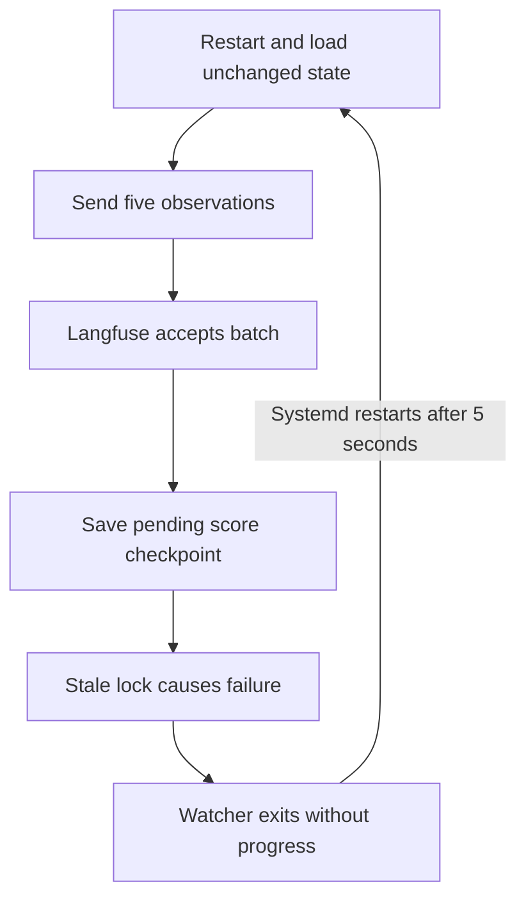

# RCA: repeated observations during the September 21 watcher restart loop

- Assessment date: 2026-09-22
- Status: incident mechanism confirmed with stored ingestion requests, journals, source, and a local reproduction
- Scope: trace `7ccb9625e6d48af64ffbb64c8851f496` from the reported duplicate rows
- Current source and installed binary: `2b8b91534704d24613975276a605ce14916b7da0`, installed build reports `vcs.modified=false`
- Production changes during investigation: none

## Conclusion

The old watcher repeatedly sent an already accepted observation batch because it could not persist its progress through an abandoned export-state lock. Each failed checkpoint terminated the watcher. Systemd restarted it, it loaded the unchanged state, and it sent the same turn again before trying the blocked checkpoint.

The stored ingestion objects contain **3,138 submissions of the same five span IDs**, or **15,690 submitted observations** for one logical turn. The median interval between submissions was **10.475 seconds**. This is direct incident evidence, not an inference from similar-looking UI rows.

The previously proposed manual-export guard does not address this incident's initiating path. The incident-specific lock and retry correction was already implemented in `827a66c` and is present in the installed binary. Remaining delivery risks require a separate assessment and planning decision.

## Evidence and timeline

Times below are UTC. The displayed turn start time is source time, not ingestion time.

| Time / measurement | Evidence |
| --- | --- |
| 2026-09-21 16:40:39.523 to 16:47:04.521 | The source parser produces exactly one completed target turn, three tool observations, and therefore five projected spans. |
| September 21 OOM episode | Fresh kernel journal reads show multiple OOM kills of processes in `codex-langfuse-watch.service`, and the user systemd manager killed at 17:43:13. The precise process death that abandoned the lock was not established. |
| 2026-09-21 17:54:25 | The restarted user service logs `watching`. Its old startup path can read state without acquiring the state mutation lock. |
| 17:54:29.247 | First retained target ingestion object in the inspected interval. It contains the root, transcript, and three tools. |
| 17:54:31 | The same service attempt logs `langfuse-export-state.json.lock: file exists` and exits unsuccessfully. |
| 17:54:29.247 through 2026-09-22 03:23:58.937 | 3,137 retained target submissions precede recovery. Every submission is followed by a lock error within 5.799 seconds; median delay is 2.024 seconds. |
| 2026-09-22 03:24:08 | Journal records the watcher being stopped for recovery. |
| 03:25:49 | Watcher starts after recovery. |
| 03:25:52.986 | Final target ingestion object; total target submissions reaches 3,138. |
| 03:25:53 | First target `exported ... status=200` and `scored` log entries. These appear only after checkpoint persistence succeeds. |
| 06:37:56 | Commit `827a66c` records the permanent lock recovery correction. This is later than the operational recovery above. |
| 07:46:45 | Current service starts with installed revision `2b8b915`, containing that correction. At inspection it is active/running with `NRestarts=0`. |

The object inventory scanned 3,151 retained OTLP objects in the configured project's time range, of which 3,138 contain the target trace. Of these, 3,137 have identical complete payload hashes; one has different attributes, including environment `default`, but the same five observation identities. That variant does not explain the repeated ordinary-environment rows.

The previously quarantined orphan lock still exists outside the active state directory. It is empty and has modification time `2026-09-21T15:32:11.556445Z`, within the recorded OOM/restart episode. The current `.lock` is a separate advisory-lock sidecar and must not be treated as an orphan merely because it exists.

There are 3,138 lock-error journal entries in the wider diagnostic window. This number should not be treated as a one-to-one total of failed target exports: the per-request timestamp correlation above is the stronger evidence. PID numbers were reused during the long loop.

### Why today's API result initially looked healthy

At inspection, both `events_full` and `events_core` contain five target rows, each with a unique span ID. The public Observations API v2 also returns five rows: one `codex.agent`, one `codex.transcript`, and three `codex.tool.generic` observations. The state file marks the trace processed, and its eight deterministic scores each occur once.

The deployed ClickHouse event tables use `ReplacingMergeTree`. The part log records **15,685 rows removed by merges from each event table** over the incident interval, exactly matching `5 * (3,138 - 1)`. These two tables are storage representations of the same observations; their counts must not be added together as separate exports. The aggregate merge log does not identify individual trace IDs, but the matching count, retained request history, and final five rows corroborate the replacement history.

A current unique-row count cannot establish that duplicates never existed. Langfuse's documented contract still does not promise reliable observation deduplication: repeated ingestion can expose duplicates and inflate metrics. This deployment's observed merges must not be used as an application delivery guarantee. See [Langfuse's update and immutability guidance](https://langfuse.com/faq/all/tracing-data-updates).

## Causal chain in the historical code

Inspected source revision: `63af12d`, before the lock correction.

1. `internal/exportstate/state.go:lock` creates an empty sidecar using `O_CREATE|O_EXCL`. Removal is deferred until normal completion. An abrupt termination can leave the sidecar behind.
2. The old `WatchSessions` loads existing state without first proving the state mutation lock is available.
3. `internal/watch/watch.go:processTurn` calls `ExportSpans` at line 150. Langfuse accepts and stores the batch.
4. It then tries to save `pending_scores` at lines 155–159. The stale sidecar prevents this mutation. Neither the pending checkpoint nor the processed checkpoint advances.
5. The error propagates out of the scan and watcher. The unit has `Restart=on-failure` and `RestartSec=5`.
6. The next process reads the same durable state and resends the same first unprocessed turn.
7. The `exported` message is emitted only at line 162, after the failed checkpoint. Consequently thousands of accepted requests have no corresponding success log. Score creation also happens after that checkpoint, explaining why the span copies multiplied while scores did not.



The fundamental defect was the interaction between a lock that survived its owner, remote side effects before local progress persistence, and restart behavior that repeated those side effects. Logging placement concealed successful remote acceptance until local persistence succeeded. The host OOM episode triggered the failure conditions; it does not excuse an unbounded resend loop.

## Reproduction and verification

All reproduction writes used temporary state and synthetic export callbacks. No real turn was re-exported to Langfuse.

| Check | Result |
| --- | --- |
| Historical `TestRCAStaleLockResendsAcceptedTurn` on an archive of `63af12d` | PASS: three simulated restarts; three accepted-export callbacks for one trace; zero score calls, pending checkpoints, processed checkpoints, or `exported` log lines. Each attempt fails with `file exists`. |
| Historical parser against the incident source, `TestRCAIncidentSourceContainsOneTurn` | PASS: one completed target turn, three tool observations, five projected spans; no transcript contents printed. |
| Current `go test ./... -count=1` | PASS across all packages. |
| Current `TestStateLockRecoversAfterKilledOwner` | PASS normally and with `-race`. |
| Current `TestWatchWaitsForStateWithoutRestarting` | PASS normally and with `-race`; no export while startup state acquisition is blocked. |
| Current `TestWatchRetriesPendingCheckpointOnly` | PASS normally and with `-race`; checkpoint contention retries persistence without resending spans. |
| `go test ./test -count=1` after documentation changes | PASS. |
| `git diff --check` | PASS. |

Local investigation material is under `$HOME/.cache/codex-trace-rca-20260922/`: `object-evidence.json` contains object timestamps, hashes, and span identities; `lock-errors.json` contains bounded journal evidence; `historical/` contains the historical source archive and reproduction tests. Raw prompt/output material is not added to this repository.

The object inventory file's SHA-256 is `7f645c78e8a0ee02145b4e279df6a6aa269ec4940d4b10be833b4134751496f6`.

Reproduction command from that archive:

```sh
go test ./internal/watch -run '^TestRCAStaleLockResendsAcceptedTurn$' -count=1 -v
```

Current focused verification:

```sh
go test -race ./internal/exportstate ./internal/watch -run 'TestStateLockRecoversAfterKilledOwner|TestWatchWaitsForStateWithoutRestarting|TestWatchRetriesPendingCheckpointOnly' -count=1 -v
```

## What is already corrected

Commit `827a66c` replaces the stale-file locking protocol with process-owned advisory locking, acquires state through a locked startup operation, and retries busy checkpoint operations in the running watcher. The current binary contains this commit. Existing tests exercise all three behaviors, and they passed during this investigation.

The running service executable (`/proc/25380/exe`) and installed binary have the same SHA-256: `ed3865e993f8abd642ab72f54b6fa2bc10e0f7c2c77dde4d8227cdecc50e91d7`. This confirms the inspected installed build is the build actually running.

This establishes that the specific stale-lock restart loop has a deployed correction. It does not establish exactly-once delivery under every crash or network failure. No fresh destructive crash experiment was performed against the production watcher.

## Remaining assessment boundaries for subsequent planning

- Remote acceptance and a durable local checkpoint are still separate operations. A process death in that interval or an uncertain network result can leave a turn eligible for replay. Existing lock recovery does not eliminate that general delivery window.
- Manual export bypasses watcher checkpoints. Its replay risks and coordination with the watcher are real source-level concerns, but they are not the established cause of this incident.
- SDK retries, multiple OTLP batches, and score timestamp identity remain separate review topics. This incident had only five spans per request, and failed attempts did not reach score creation. Those topics must not be presented as this incident's cause.
- A pre-export remote lookup alone is not an atomic delivery guarantee. Current reads also cannot reconstruct historical duplicates after storage merges.
- The old duplicate-safe export proposal's strict canonical-shape classifier, whole-invocation preflight, and score timestamp migration are unvalidated design choices. They should not be implemented merely because this incident showed duplicates.
- No historical cleanup is justified by the present target row count: it is already five unique observations. Retained ingestion objects are evidence; this investigation does not authorize their deletion.

The subsequent [delivery diagnostics implementation plan](export-delivery-reliability-plan.md) retains the documented at-least-once behavior and uses the deployed lock correction as its baseline. It covers operational instruction fixes, diagnostics, and isolated acknowledgement-loss/crash tests. Reconciliation, manual/watcher coordination, and score migration remain separate work; this incident does not establish a requirement for them.
