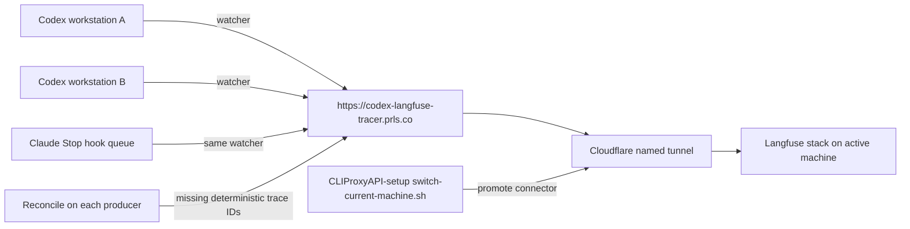

# Multi-Machine Tracing Gateway Handoff

- Project: `codex-langfuse-tracer`
- Document ID: CLT-HANDOFF-MULTI-MACHINE-001
- Version: 1.0
- Date: 2026-08-15
- Owners: repository maintainers; infrastructure owner for `prls.co`
- Status: client cutover operational; gateway promotion and repository-owned reconciliation not implemented
- Related repository: `~/p/CLIProxyAPI-setup`

This document is the canonical handoff for making one public Langfuse hostname serve traces from every coding-agent workstation while allowing an operator to move the public gateway to another machine. It records the verified runtime state, decisions, ownership boundaries, intended command-line experience, implementation sequence, acceptance evidence, and known gaps. It is standards-informed lifecycle documentation, not a claim of ISO/IEEE or safety-critical compliance.

**2026-09-23 06:16 PDT watcher recovery implementation publication/install:** runtime source `db270362f898e6be2e37220d8aefe7fdf517cd11` was pushed to `main` and installed with `./install.sh`. Installed and running executable digests match at `7d638c452c382828b0146c82b0382db156dd3d0c1e9cb63e6ecc5d96c7cb1389`; build metadata reports `vcs.modified=false`. `codex-langfuse-watch.service` is enabled and active with zero post-cutover restarts. State v3 is preserved (processed=1,060, queue=0, pending scores=0). A fresh 60-minute W6 observation began at 06:05:41 PDT and remains incomplete. Early samples show `MemAvailable` above 2 GiB but repeated PSI avg10 breaches of the predeclared some/full limits 5.0/1.0; no kernel OOM line has been found since cutover. The doctor recent-error window is still failing on `changed_sources` markers without discovery/stat/parse/delivery errors. The prior user waiver applied to the W4 same-host memory matrix; it does not convert these W6 host-pressure samples into a capacity pass. Fresh automatic Codex canary and its read-only trace-shape check are pending.

**2026-09-23 06:21 PDT automatic Codex canary and 06:25 doctor snapshot:** Codex CLI `0.156.1` using configured model `gpt-6-luna` completed a fresh benign turn. The existing watcher logged span export success, exported, and scored at 06:20:21 PDT. The read-only `TestLiveCodexSmokeTrace` passed with one `codex.agent` root, one `codex.transcript` generation, two observations, unique IDs, stable for five seconds. This establishes the current canary's shape only, not historical uniqueness or backend-wide exactly-once behavior. The 06:25 doctor command exited 1: config, Langfuse health/auth/project, state and watcher passed, while `recent_errors` failed with count 43. The path-free 15-minute journal summary had 44 incomplete-scan lines with zero discovery/stat/parse/delivery errors and `changed_sources` sum 51. Claude CHECK-001 remains unperformed because Claude CLI is unavailable here. The W6 observation remains open, with the recorded PSI breaches above the fixed thresholds; do not treat the canary pass as host-capacity acceptance.

**2026-09-23 06:32 PDT W6 host-capacity interruption:** one-minute samples showed the reserve below 2 GiB and avg10 PSI at `some/full=76.22/51.33` at 06:31, then `86.84/56.16` at 06:32. The kernel recorded a global OOM kill of a Chrome process at 06:31:14 and another OOM-killer invocation at 06:31:49. The watcher remained active with `NRestarts=0`, and state had no queue or pending scores. This invalidates the first W6 host-capacity window; the event does not establish an initiating workload. No unrelated process was manually stopped or restarted. Continue same-host monitoring under the user's authorization, but begin a fresh 60-minute host acceptance only after the original reserve and PSI thresholds recover. The [scan recovery and memory validation plan](watcher-scan-recovery-and-memory-validation-plan.md) contains the full measured record.

**2026-09-23 06:50 PDT resource stop and handoff:** at the user's request, the one-minute observer was stopped at 06:37:27 to reduce activity; no active tests or Docker containers remained. Systemd recorded repeated OOM kills of the watcher during global host pressure, and its restart count reached 14. At the last check the production watcher was active/running and version 3 state was intact (1,067 processed, no queue or pending scores). The 60-minute host acceptance and recent-errors doctor gate did not pass. The user requested that the production watcher remain running. Resume with a fresh one-hour host window only after the fixed reserve/PSI limits recover, then verify no OOM/restarts and run doctor after 15 quiet minutes.

**2026-09-22 audit correction and next work:** the streaming/filtering runtime and its earlier service observation remain valid historical evidence. Full memory/host-capacity acceptance was overstated: the large-source probe could pass without consuming its target, its processed count came from the entire state, and the later 4 GiB threshold was not justified before measurement. Source discovery/stat failures and repeated parsing behind corruption also needed correction. The [watcher scan recovery and memory validation plan](watcher-scan-recovery-and-memory-validation-plan.md) now owns this follow-up and preserves state v3 and the delivery contract. W1's real-source probe and the full W5 local verification pass. The candidate is not published or installed. The 18:27 PDT global OOM and two interrupted comparative-matrix runs that breached PSI limits are recorded below. The later audit also found that their P100/P400 inputs omitted the planned completed EOF turn; those partial RSS values are not valid for the declared cases. The other dated snapshots describe conditions at those times, not current verification.

**2026-09-22 RCA and deployment update:** the [reported repeat-export incident](duplicate-observations-rca-20260922.md) was the historical watcher checkpoint/lock restart loop. The lock recovery correction in `2b8b915` was installed during that RCA, and the user confirmed the duplicate rows were no longer visible. The [delivery diagnostics follow-up](export-delivery-reliability-plan.md) is published and deployed in runtime revision `78bfafeeb27f619e4df6f9af01cb768c9dacc55c`. Installation preserved version 3 state; the installed and running executable digests matched. A benign Codex turn passed the automatic watcher path, and its read-only Langfuse observation check returned one root, one transcript, two observations total, with unique IDs stable for five seconds. The at-least-once contract remains, including the remote-acceptance/local-checkpoint replay window. During verification, the host had two global-OOM events that killed and auto-restarted the watcher; the latest check found it active/enabled with intact state and zero recent errors, but the initiating workload remains unknown and sustained availability is not established. Claude-specific CHECK-001 was unperformed because Claude Code is not installed on this host. Reconciliation remains independent and unimplemented; refresh its older observation-read, visibility, and error assumptions before implementing writes. The earlier shared-classifier and manual-preflight proposal is outside this follow-up.

**2026-09-22 14:36 PDT operational hold:** subsequent read-only monitoring found continued OOM kills in `codex-langfuse-watch.service`; `NRestarts` rose from 32 at 14:26 to 49 at 14:36. It was active/running at the 14:36 snapshot, but that transient state is not an availability pass. At 14:33 the host had 30 GiB RAM with 29 GiB used, 221 MiB free, 1.1 GiB available, 8 GiB swap effectively exhausted, and severe memory PSI (`some` avg10 93.21; `full` avg10 66.78). A process snapshot showed several large worker, Codex, Node/web-server, and ClickHouse processes; no single process is established as the pressure source. Recent watcher OOM victims included 169.5-548.2 MiB memory peaks, while earlier victims reached roughly 0.77-0.79 GiB RSS. At that snapshot the Codex parser read and split each full source file in memory, which is a separate unbounded-input risk but is not proven to explain the repeated kills. No host process was stopped and no OOM priority, cgroup limit, service policy, or data state was changed. Production availability remains blocked pending owner-led, workload-aware memory remediation and at least 60 minutes with no new watcher restarts or OOM events, recovered host pressure, healthy doctor/state checks, and then one fresh automatic canary followed by a read-only shape check. Preserve state and do not manually replay a canary.

**2026-09-22 14:41 PDT RCA refinement:** the stored watcher watermark was `1790113320577025434` ns. A 113.7 MB rollout file had an mtime 2.76 seconds newer, making it eligible under `ScanOnce`; that code calls `ParseTurns`, which reads the entire file, duplicates it as a string, splits all lines, and retains observations for already-processed turns until parsing ends. The active watcher itself measured 824 MiB RSS, 1,097 MiB high-water RSS, and 1,893 MiB VmData after 81 seconds. A restart before the watermark checkpoint leaves the same file eligible after service restart. This is strong evidence that whole-file/all-turn parsing amplifies the host OOM loop, though the concurrently exhausted host and allocation-level cause also matter. The [P6 fix](export-delivery-reliability-plan.md) is in progress: stream JSONL and filter processed turns before retaining their observations; preserve version 3 state, pending-score retries, and all unprocessed turns. Do not cap or skip large files. Do not stop the active tmux or Docker workloads found in the process snapshot without owner review.

**2026-09-22 15:09 PDT P6 execution update:** the implementation now reads rollout records line-by-line, filters processed trace IDs before accumulating turn observations, and leaves the watermark unchanged when parsing fails. The 2,000-turn parser and watcher regressions, malformed-input watermark test, full Go suite, parser/watcher race checks, parser fuzz run, and diff check pass. The code is not yet committed or installed. The old runtime remained active with `NRestarts=85`, unchanged from 15:03 to 15:09; available RAM was 4.6 GiB and swap remained full. This short interval is not the 60-minute post-install availability acceptance. Install the new revision without resetting state, then verify memory while it scans the same eligible large file before running a new canary.

**2026-09-22 P6 large-input validation:** after installing runtime code commit `0912de5c89d93f0edc8f0b43217c2bc4fea57882`, the env-gated `TestLiveCodexLargeRolloutFilteredScan` ran the actual 117,007,638-byte source through `ScanOnce` via a temporary symlink. It used a read-only copy of version 3 production state in memory and set only that temporary state's watermark to make the source eligible; span and score callbacks were local stubs. The invocation reported 1,020 processed IDs from the entire supplied state, invoked zero callbacks, completed in 1.39 seconds, and measured 41,408 KiB maximum RSS. It made no Langfuse requests and did not write production state. **Audit correction:** its watermark assertion did not prove the target was consumed; those values describe the invocation, not confirmed incident-input or memory acceptance. At the time of this check, before the final 15:24 install, the required 60-minute window remained pending.

**2026-09-22 16:25 PDT deployment and service observation (capacity acceptance remains open):** final runtime code is `0912de5c89d93f0edc8f0b43217c2bc4fea57882`, installed from build revision `03139fa58eb57c9a66b24c76903847d9c1330ea3`. The installed binary and `/proc/1181025/exe` both had SHA-256 `9433a8c1ea7c944f47de0bee9def162a06f6605c79a566820788b67eb4dd23df`; the service was enabled, active, and running. From 15:24:53 to the 16:25 snapshot, `NRestarts` stayed zero and the kernel log contained no OOM event. `MemAvailable` stayed roughly 4.0-4.9 GiB compared with 1.1 GiB at the 14:33 incident snapshot; memory PSI stayed near zero. The 8 GiB swap file remained full, but measured swap-in/out activity was low, so no swap reclamation or unrelated workload interruption was attempted. Doctor reported config, health, auth, project, watcher, and recent-errors checks OK; state v3 had 1,024 processed traces, zero pending scores, and an empty queue.

**2026-09-22 18:27 PDT renewed operational hold:** while the follow-up was under way, the installed baseline watcher was reported OOM-killed during global host memory pressure and systemd restarted it once. No candidate code had been installed, and no service restart was initiated by this work. At the 18:28 sample the new invocation was active; `MemAvailable` was about 3.30 GiB, but PSI remained above the frozen limits (`some avg10=8.89`, `full avg10=5.33`) and swap counters were still moving. Kernel records show concurrent global OOM victims without establishing one root cause. No unrelated process was stopped. The earlier 16:25 observation remains historical; start a fresh 60-minute acceptance only after reserve and PSI recover, and do not install during pressure.

**2026-09-22 18:43-18:45 PDT comparative-matrix hold:** the candidate and exact installed-baseline test binaries were run against the same generated sources and v3 state in separate 768 MiB no-swap worker scopes. The first baseline build attempt used the candidate checkout; identical binary digests caught the setup error before measurements. The baseline was rebuilt from a detached worktree at `03139fa58eb57c9a66b24c76903847d9c1330ea3`, with a distinct digest. P100 and P400 each completed five candidate and five baseline samples, and U100 completed five candidate samples; those values remain partial data, not acceptance. At 18:44:52 host `MemAvailable` was 3,475,420 KiB but PSI avg10 some/full was `1.25/1.05`, above the fixed full-PSI limit; a between-sample read reached `3.93/3.29`. The matrix was interrupted, and the first U100 baseline sample terminated with its parent. Swap counters advanced during the interval without a proven cause. The installed service remained active with `NRestarts=1`; no candidate was installed and no unrelated workload was stopped. W4 must be rerun in a stable environment with one-minute host samples and every matrix case complete.

**2026-09-22 18:57-18:58 PDT W4 retry:** after rebuilding both binaries and adding a linker-stamped check that makes the baseline worker fail on a wrong source revision, a second matrix run completed five P100 candidate/baseline samples. It again reached the PSI threshold during P400: the 18:58:31 sample had `MemAvailable=3,403,788 KiB`, PSI some/full avg10 `1.90/1.59`. Four P400 candidate samples completed; the fifth and all later cases were interrupted. The available-memory reserve stayed above 2 GiB, but PSI alone invalidates acceptance. No worker or sampler remained afterward, and synthetic scratch was cleaned. W4 should be completed on a separate sufficiently provisioned host; do not keep retrying P400 on this host under the same workload.

**2026-09-22 19:12 PDT fixture-oracle correction:** self-review found both matrix attempts used P100/P400 inputs with only processed turns, while the W4 case contract requires one new completed turn at EOF. Those partial RSS measurements are disqualified for P100/P400. The fixtures now include and assert the EOF trace, completion, input/output projection and callback counts for candidate and baseline; a normal 1 KiB fixture test validates the construction. The corrected fixture test, full suite, targeted race suite and coverage run pass. The complete corrected resource matrix has not run; rebuild both binaries from the corrected helpers and measure on a separate sufficiently provisioned host. W4/W6 remain open.

**2026-09-22 19:21 PDT local verification closeout:** final review found no further code changes were needed. `gofmt -d` over changed Go files was clean, `git diff --check` passed, and secret-pattern scanning passed for all 18 changed/new files. W5 is complete: the full local suite, coverage, race, fuzz, repeat-regression, latency and documentation checks are recorded in the follow-up plan. W4 still required a corrected matrix at this point: earlier P100/P400 samples omitted the selected EOF turn. The corrected matrix and W6 publication, install, 60-minute observation, and new automatic canary had not yet run.

**2026-09-23 05:47-05:57 PDT same-host W4 run:** following the user's explicit direction to proceed here and acceptance of possible data loss, the corrected seven-case candidate/baseline matrix completed with five serial samples per revision. All case oracles passed, and candidate RSS ranged from 32.6 MiB (S100 worst sample) to 198.5 MiB (U100 worst sample), below the 768 MiB worker cap. The host-pressure guard was waived for this run; it was not met. PSI avg10 peaked at some/full `68.75/41.33`, and `MemAvailable` reached `1,432,568 KiB`. Kernel records show global OOM kills during the test, including the watcher at 05:55:32; systemd restarted it at 05:55:38 (`NRestarts=1`). Several unrelated processes were also OOM-killed. The timing does not establish a sole initiating workload. No unrelated process was manually restarted. Full RSS vectors, source sizes, binary digests and per-case oracles are recorded in the [follow-up plan](watcher-scan-recovery-and-memory-validation-plan.md). Before W6 install, verify service identity and version 3 state; after install, start a new 60-minute observation and record any OOM, restart, PSI or state backlog. At this timestamp, publication and install remain pending.

After that window, a new Codex session passed the automatic path with trace `865cae697c1c7fa615ebf11f0289b30d`: watcher logs showed `span_export_succeeded` and `exported` with status 200, followed by `scored`. The read-only `TestLiveCodexSmokeTrace` found exactly one root, one transcript, and two observations, with unique IDs stable for five seconds. The full Go suite, targeted parser/watcher race tests, fuzz run, and diff check had passed before publication. This validates the observed runtime and canary; it does not prove exactly-once delivery or identify the host-wide OOM source. Full swap and that unknown source remain explicit operational risks. Claude CHECK-001 remains unperformed because Claude Code is unavailable.

## Outcome

### Inputs

- Codex rollout JSONL under `~/.codex/sessions/` on each workstation.
- Claude Code transcript paths delivered through the documented Stop hook.
- One Langfuse project key pair provisioned privately on each workstation.
- A Langfuse stack on the machine selected to serve the public hostname.
- Cloudflare credentials and tunnel state owned outside this public repository.

### Outputs

- Every workstation exports to one stable URL: `https://codex-langfuse-tracer.prls.co`.
- One existing operator command promotes the current machine as the public gateway.
- One exporter reconciliation mode fills completed Codex traces missing from the currently active Langfuse backend.
- Claude and future hook-driven providers retain failed queue entries locally and retry through the normal watcher when the canonical URL becomes healthy.
- Cutover and reconciliation print bounded progress and a final machine-readable summary without exposing credentials or trace contents.

## Current verified state

The following is a dated snapshot. Re-run the evidence commands before implementation or deployment; do not assume workstation, tunnel, process, or credential state remains unchanged.

| Surface | Verified state on 2026-08-15 |
| --- | --- |
| Repository | Performance-test implementation PR #8 merged to `main` at `4a3b4b4`. This handoff closeout changes evidence only; use the current runtime evidence commands below instead of treating the recorded SHA as the latest repository head. |
| Canonical endpoint | `https://codex-langfuse-tracer.prls.co/api/public/health` returned HTTP 200 and the configured project keys authenticated. |
| Current workstation | `codex-langfuse-watch.service` used `~/.codex/langfuse-exporter.toml`, targeted the canonical endpoint, was active with zero restarts, and had queue length zero. The private config mode was `0600`. |
| Live delivery | An active trace returned HTTP 200 from the canonical endpoint and HTTP 404 from the workstation's local Langfuse instance. |
| Reconciliation prototype | A machine-local, untracked `~/.codex/bin/switch-langfuse-target` helper exported 160 missing completed traces from rollout files modified since 2026-07-30. A second inventory found 260 of 260 unique completed traces present, with zero missing and zero failed lookups. |
| Local Langfuse | A loopback instance at `http://127.0.0.1:3031` remained healthy but was not the configured export target. |
| Claude Code | The repository supports explicit transcript export and Stop-hook queueing. The Stop hook was not installed on the verified workstation. |
| Gateway switching | `~/p/CLIProxyAPI-setup/scripts/switch-current-machine.sh` was committed at adjacent repository commit `22d1c0e` and switched only the CPA tunnel. It did not move the Langfuse tunnel or data. |
| Release state | The operational client cutover did not require a tracer release. Test and documentation closeout PR #8 merged to `main` at `4a3b4b4`; because it changed no runtime code or configuration, no binary release or service deployment was applicable. Machine-private configuration changes were not committed. |
| Test state | On merged `main` at `4a3b4b4`, `go test ./... -count=1` passed, including the `test` package in 311.945 s. The affected correctness packages passed ten consecutive runs. Five benchmark samples were recorded for `BenchmarkInsightRollup` and `BenchmarkClaudeParserCorpus`. The post-merge binding watcher and Claude queue latency tests passed 5/5; watcher scan wall time ranged from 18.785 ms to 75.770 ms with logical p95 of 5 s. [ADR-PERF-001](performance-test-stability.md) documents why the former developer-host micro-timers were retired. |
| Security action | Private credential values appeared in diagnostic tool output during the operational cutover. A later process listing also captured an OpenRouter key embedded in an unrelated process's command-line arguments while the watcher was active, so the affected trace must be treated as sensitive. No values belong in this repository. Rotate the affected workstation credentials through their owning systems and apply the operator's trace-retention policy before treating the incident as closed. |

### Current runtime evidence commands

The 2026-09-22 export-state recovery update uses a persistent advisory lock, retries contended watcher transactions in the same process, and preserves version 3 state. Graceful signal handling is scoped to the watcher; hooks retain normal termination while reading stdin. Installation stages and preflights the actual executable before stopping the managed watcher and promoting it. The [lock recovery plan](export-state-lock-recovery-plan.md) records the implementation, review corrections, and local gates. The [issue #13 closeout](https://github.com/kirilligum/codex-langfuse-tracer/issues/13) records the published revision, installed artifact identity, state preservation, and scoped runtime acceptance for this update. The older table above remains a dated snapshot.

These commands are implemented today and do not print secret values:

```sh
git status --short --branch
git log -1 --decorate --oneline
systemctl --user show codex-langfuse-watch.service -p ActiveState -p SubState -p NRestarts -p ExecStart
~/.codex/bin/codex-langfuse-exporter --config ~/.codex/langfuse-exporter.toml --doctor
curl -fsS https://codex-langfuse-tracer.prls.co/api/public/health
```

The separate `~/.codex/langfuse-exporter.toml` and systemd override are current machine-private deployment facts, not a public installation contract. Do not copy credentials or this workstation's private configuration into the repository.

### Closeout verification evidence

The performance-test and documentation closeout was validated with existing repository commands:

```text
git diff --check
go test ./test -run 'TestDocs|TestEvalDocs' -count=1
go test ./... -count=1
go test -p=1 ./internal/watch -run '^(TestEvalWatchExportLatency|TestEvalHookQueueDrainLatency)$' -parallel=1 -count=5 -v
go test -p=1 ./internal/agenttrace ./internal/claudetrace -run '^$' -bench 'Benchmark(InsightRollup|ClaudeParserCorpus)$' -benchmem -count=5
```

All correctness and binding latency commands passed. The benchmarks are non-binding engineering evidence, while the watcher and Claude queue tests remain the binding latency controls. No production behavior changed in this closeout.

## Decisions

### ADR-MM-001: One stable client destination

All Codex, Claude Code, and future coding-agent exporters shall target `https://codex-langfuse-tracer.prls.co`. A gateway move changes Cloudflare connector ownership, not each producer's exporter configuration. Client-side local/remote switching is not the production architecture.

### ADR-MM-002: One gateway promotion command

The existing `bash scripts/switch-current-machine.sh` command in `CLIProxyAPI-setup` remains the single operator entry point for promoting the current machine. Extend that command to include the Langfuse origin and tunnel instead of creating another library, umbrella CLI, compatibility command, or second promotion workflow.

Today that command switches CPA only. Documentation must not claim Langfuse support until the adjacent repository implements and tests it.

### ADR-MM-003: Trace reconciliation, not live database-volume rsync

Do not rsync mounted PostgreSQL, ClickHouse, object-store, or Langfuse Docker volumes between running machines. Do not merge `~/.codex/langfuse-export-state.json` files. These approaches can copy inconsistent database state, overwrite backend-only traces, or corrupt local watcher progress.

Reconciliation shall use deterministic trace IDs and the existing Langfuse API:

1. Enumerate completed local Codex turns through `codextrace.SessionPaths`, `codextrace.ParseTurns`, and `agenttrace.ExportableTurns`.
2. Query the configured Langfuse project for each deterministic trace ID.
3. Reuse the existing `langfuse.ExportSpans`, deterministic score export, and trace verification paths only for missing traces.
4. Re-query or verify exported traces before reporting success.

This is eventual recovery, not synchronous database replication. If a producer machine is offline, traces that exist only in its local source files cannot be reconstructed until that producer returns.

### ADR-MM-004: One reconciliation mode in the existing binary

Add one mode to `codex-langfuse-exporter`; do not productize the untracked shell helper and do not add a second exporter. The required post-implementation interface is:

```sh
~/.codex/bin/codex-langfuse-exporter --reconcile
```

The mode scans the complete local Codex rollout corpus by default. It shall not require a target name because the configured canonical host is the only destination. It shall not change the watcher target, replace the watcher state, or create another state file.

The success summary shall contain stable fields equivalent to:

```text
reconcile source_candidates=<n> source_duplicates=<n> unique_traces=<n> already_present=<n> exported=<n> missing=<n> failed=<n>
```

Success requires `missing=0` and `failed=0`. Exact wording becomes a tested public CLI contract when the mode is implemented.

### ADR-MM-005: Preserve provider trigger boundaries

- Codex reconciliation may discover rollout files because `internal/codextrace/sessions.go` already owns that source contract.
- Claude Code remains hook-to-queue-to-watch. Do not add Claude directory polling or a second Claude transcript registry.
- A failed Claude export remains queued in the existing state and retries when the canonical endpoint is available.
- Historical Claude transcripts not retained in the queue require the existing explicit command: `--provider claude --path <transcript.jsonl>`.
- Future providers use the existing provider registry and normalized trace contract. Do not add placeholder provider scanners.

### ADR-MM-006: Accept current at-least-once semantics

Reconciliation performs a remote existence read before export. A watcher can still win the race between lookup and export, and an ambiguous remote acknowledgement can still cause a duplicate retry. This is consistent with the repository's documented at-least-once guarantee. Deterministic IDs and a preflight read do not establish receiver deduplication. The diagnostics follow-up retains this policy and does not add a distributed lock, leader election, pending-batch protocol, or remote transaction coordinator. Strict duplicate prevention would require a separate delivery contract; no frequency estimate for these races has been established.

### ADR-MM-007: Do not hand off an active coding process

Moving the gateway does not move a running Codex or Claude process. An unfinished Codex turn remains owned by the watcher on its producer machine and continues exporting to the stable hostname when reachable. Reconciliation exports completed turns only. Do not invent partial-session transfer or cross-machine process migration.

### ADR-MM-008: Keep secrets machine-private

Project keys, Cloudflare API tokens, tunnel tokens, login credentials, and private `.env` files remain outside Git. Each machine receives the same canonical Langfuse project keys through private provisioning. Verification prints only HTTP status, project ID, counts, and redacted error context.

Do not pass API keys directly in process arguments. Process-list diagnostics can expose command-line arguments, and this exporter can capture that terminal output. Use private environment files, credential files, or the owning tool's secret store.

## Architecture



```text
[Producer machine]
  Codex rollout files -----------+
  Claude Stop-hook queue --------+--> [one local watcher]
                                       |
                                       v
                         codex-langfuse-tracer.prls.co
                                       |
                              [Cloudflare tunnel]
                                       |
                                       v
                           [active Langfuse stack]

[Operator on replacement machine]
  CLIProxyAPI-setup/scripts/switch-current-machine.sh
      -> prepares local origins
      -> starts new connector
      -> waits for connector registration
      -> removes previous connector IDs

[Producer after backend change]
  codex-langfuse-exporter --reconcile
      -> local completed Codex corpus
      -> remote trace-ID inventory
      -> export and verify missing traces
```

## Operational invariants

- `codex-langfuse-tracer.prls.co` is the only production exporter destination.
- A workstation watcher never writes to two Langfuse targets.
- One local state file remains authoritative for one workstation watcher.
- Trace identity is deterministic and provider-aware.
- Reconciliation reads completed source turns and remote trace existence; it does not trust another machine's watcher state.
- Gateway promotion does not claim data reconciliation is complete.
- The previous connector can reconnect after Cloudflare connection deletion if its process remains active. The operator must stop the old connector when that machine is reachable; do not report exclusive promotion while both connectors are registered.
- A public health check alone is insufficient. Promotion acceptance requires authenticated Langfuse API access and a real trace visibility check.

## Implementation sequence

### Phase 1: Add repository-owned reconciliation

Scope: `codex-langfuse-tracer` only.

1. Add failing CLI parsing and mode-exclusivity coverage in `cmd/codex-langfuse-exporter/cli_test.go` for `--reconcile`.
2. Add failing deterministic reconciliation coverage using `testdata/manifest.json`, existing Codex fixtures, and an `httptest.Server`. Cover already-present, missing, duplicate source trace ID, authentication failure, lookup failure, export failure, verification failure, cancellation, and a zero-missing rerun.
3. Implement one `internal/reconcile` package that composes existing session enumeration, parsing, projection, score, and verification owners. Do not duplicate OTLP construction, score construction, redaction, trace-ID logic, or fixture inventory.
4. Wire `--reconcile` into `cmd/codex-langfuse-exporter/main.go` as an exclusive source mode using the existing `--config`, `--quiet`, and context cancellation behavior.
5. Emit bounded progress and the stable final count summary. Never print prompts, answers, tool output, keys, or authenticated response bodies.
6. Update `README.md` and `TESTING.md` only after the command exists and the tests define its exact public behavior.

Required focused verification after the tests exist:

```sh
go test ./cmd/codex-langfuse-exporter ./internal/reconcile -count=1
go test ./test -run 'TestGoldenTraceContract|TestDocs' -count=1
git diff --check
```

### Phase 2: Extend the existing gateway promotion command

Scope: `~/p/CLIProxyAPI-setup`; do not implement this phase from the tracer repository checkout.

1. Extend `scripts/switch-current-machine.sh`; do not add a second promotion command.
2. Reuse `scripts/lib/common.sh`, `.env.local`, the existing operation lock, Cloudflare API helpers, connector registration wait, and previous-connector cleanup.
3. Add local Langfuse health and authenticated API preflight before changing connector ownership. Credential values must remain private and absent from command output.
4. Start the current machine's Langfuse connector, wait until Cloudflare reports the new connector, remove previous connector IDs, and print the old-connector shutdown requirement.
5. Extend `tests/static/switch_current_machine_contract.sh` and `tests/security/secret_hygiene.sh` before changing script behavior.
6. Keep CPA and Langfuse failure reporting distinct inside the one command so an operator knows which origin failed, while retaining one external entry point.

Use the adjacent repository's existing gates:

```sh
make test-static
make test-security
make verify
```

`make test-public` and `make eval` remain release evidence commands when their documented live dependencies are available.

### Phase 3: Standardize producer-machine configuration

1. Provision the canonical hostname and one project key pair privately on every producer machine.
2. Install the repository's systemd user service on each Linux workstation through `./install.sh`.
3. Install the documented Claude Stop hook only on machines where automatic Claude export is approved.
4. Remove local-host production targets after the canonical endpoint passes health, authentication, and trace visibility checks. Local Langfuse may remain as a development fixture but is not a fallback target.
5. Resolve the current workstation's explicit `~/.codex/langfuse-exporter.toml` override into the one supported fleet configuration before release. Do not leave two documented configuration paths.

### Phase 4: Perform the failover and reconciliation drill

1. Record the active machine, public health result, authenticated project result, current connector IDs, and a known trace ID without recording credentials.
2. On the replacement machine, run the extended existing command:

   ```sh
   cd ~/p/CLIProxyAPI-setup
   bash scripts/switch-current-machine.sh
   ```

3. Confirm only the intended connector remains registered. Stop the old connector if the old machine is reachable.
4. On each online producer machine, run the implemented reconciliation mode:

   ```sh
   ~/.codex/bin/codex-langfuse-exporter --reconcile
   ```

5. Require `missing=0` and `failed=0` from every producer. Offline producers remain an explicit pending recovery item until they return and reconcile.
6. Start and complete a new Codex turn, then confirm one canonical batch at the endpoint containing the logical root, generation, and tool observations.
7. Confirm the root and generation observations contain the expected input/output and that no synthetic terminal aggregate appears.
8. If Claude automatic export is enabled, execute `CHECK-001` from `TESTING.md`.

### Phase 5: Release only with complete evidence

Run the production gate exactly as documented in `TESTING.md`. Microbenchmarks are non-binding engineering evidence; the binding watcher and Claude queue latency thresholds remain release-blocking. Do not add load-based skips, retries, CPU-affinity requirements, or alternate release paths.

Required release evidence:

- Green `go test ./... -count=1` from `codex-langfuse-tracer`.
- Green full production gate from `TESTING.md`.
- Green applicable `CLIProxyAPI-setup` Make targets.
- Clean `git diff --check` in both repositories.
- Commits pushed, reviewed, and merged in both owner repositories.
- A tracer release/tag if the repository's normal release workflow requires one for the new binary.
- Installed binary and service version recorded on every producer machine.
- Public failover drill evidence with trace IDs, counts, connector IDs, and timestamps but no credentials or trace content.
- Credential-rotation action closed outside the public repository.

## Test requirements

The implementation must prove:

- A trace present remotely is never exported by reconciliation.
- Duplicate source records collapse to one deterministic trace ID.
- A missing completed trace is exported through the existing projection and becomes remotely queryable.
- An incomplete turn is not finalized by reconciliation.
- A second reconciliation run exports zero traces.
- Authentication, remote lookup, export, verification, and cancellation failures produce non-zero exit status and accurate final counts.
- Reconciliation does not mutate `~/.codex/langfuse-export-state.json` or the configured host.
- Claude directory discovery, direct hook export, alternate state files, and a second fixture registry remain absent.
- Logs and summaries contain no configured credential values or fixture secret sentinels.
- Gateway promotion does not remove old connectors until the new connector is registered and the local Langfuse origin is ready.

## Suspension and resumption

Stop implementation and request an explicit decision if any of these occurs:

- The active Langfuse API cannot query a trace by deterministic ID.
- The existing projection cannot safely re-export a missing completed trace without changing normalized output.
- The gateway must preserve data while every producer containing the source corpus is permanently unavailable; that requirement needs a separate database backup or replication design.
- Cloudflare connector deletion cannot produce the required ownership semantics without changing the existing CPA cutover contract.
- The fleet cannot converge on one private exporter configuration path.

Resume only after the blocking contract is documented in this plan and covered by a failing test or an adjacent-repository issue.

## Explicit non-goals

- Automatic failover, leader election, consensus, or health-check-driven promotion.
- Live PostgreSQL or ClickHouse replication.
- Rsync of running Langfuse volumes or exporter state.
- A new shared switching library or daemon.
- Client-side fallback from the canonical endpoint to localhost.
- Multiple supported gateway promotion commands.
- Claude transcript directory polling or wrapper execution.
- Transfer of unfinished coding-agent processes between machines.
- Placeholder support for coding agents without real fixtures and a stable source or hook contract.

## Success definition

This work is complete only when another operator can start on a supported machine, run the single existing gateway promotion command, reconcile every online producer with the one exporter mode, observe zero missing and zero failed traces, pass both repositories' release gates, and verify a new completed trace through `https://codex-langfuse-tracer.prls.co`. Documentation, code, tests, commits, releases, deployments, and the credential-rotation action must all agree with that state.
